# Algorithms

This document is for an engineer who is about to change code in
`generation_chain/`. It covers what happens inside the tool: the data
structures, the control flow, the decision points, and the refusals. It does
not cover deployment, network edges, or trust boundaries; see
[architecture.md](architecture.md) for the system view and
[../security/threat-model.md](../security/threat-model.md) for the security
posture. It is not a tutorial; for that, start with
[the project README](../../README.md) and
[repository-layout-and-reachability.md](../repository-layout-and-reachability.md).

Two terms recur everywhere below. A **generation** is one version of the
repository's catalog: Elasticsearch writes a new `index-N` at the repository
root every time a snapshot finishes or a delete completes, and never edits an
old one. A **root generation** is that `index-N` document, a complete
`RepositoryData` object naming every live snapshot and every index those
snapshots reference. Each index also has its own **shard generation**
documents, `indices/<index-uuid>/<shard>/index-<gen>`, which name the segment
blobs one shard's snapshots reference. Reading a chain of root generations and
comparing them against the shard generation documents they name is the whole
algorithm.

The safety condition this tool is built around, stated once here because
every diagram below is a picture of some piece of it: **the believed set of
references must be a superset of the true set.** An extra reference costs
storage. A missing reference costs data. Every uncertainty resolves toward
more references and a shorter manifest.

## Contents

1. [Data structures](#data-structures)
2. [Shard document identity](#shard-document-identity-earning-trust-for-one-read)
3. [The derivation, end to end](#the-derivation-end-to-end)
4. [The condemnation decision](#the-condemnation-decision)
5. [The shape gate cascade](#the-shape-gate-cascade)
6. [One loop cycle](#one-loop-cycle-audit-dry-run-approve-execute)
7. [Manifest state machine](#manifest-state-machine)
8. [Exit code map](#exit-code-map)
9. [Read-ahead and concurrency](#read-ahead-and-concurrency)
10. [Memory model](#memory-model)
11. [Existence is three-valued](#existence-is-three-valued)

## Data structures

Three focused diagrams rather than one crowded one, because the parsed
on-disk shapes, the working state one run builds, and the credential and
delete-time shapes belong to different readers.

### The parsed catalog

These are the shapes `formats/repository_data.py` and
`formats/shard_snapshots.py` build directly from bytes, defined in
`generation_chain/model.py`. Nothing downstream reaches back into the bytes;
everything downstream reads these records.

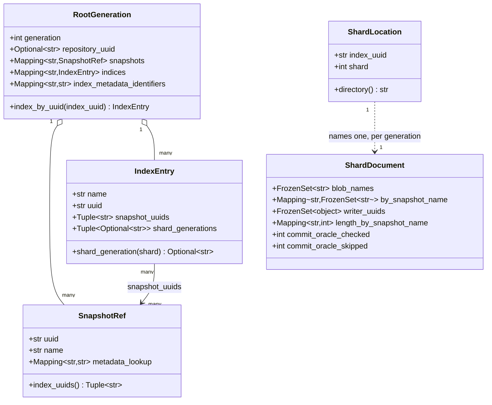

`RootGeneration` is one `index-N`, decoded and cross-checked so that its two
halves, the `snapshots` array and the `indices` map, agree with each other
(`formats/repository_data.py::_cross_check`); a generation whose halves
disagree never becomes one of these. `ShardDocument` is one
`indices/<uuid>/<shard>/index-<gen>`, and it can never be built with an empty
`blob_names`: that is the shape gate, covered on its own below. `IndexEntry`
carries `shard_generations`, one id per shard, where a missing id and a
missing shard both read as `None`, "no opinion", never as "no live files."

### What one run builds

`Chain` (in `derivation/chain.py`), `ShardHistory` and `ShardSurvey` (in
`derivation/shards.py`), and the verdict shapes in `derivation/classification.py`
and `model.py` are working state, held only for the run that built them.

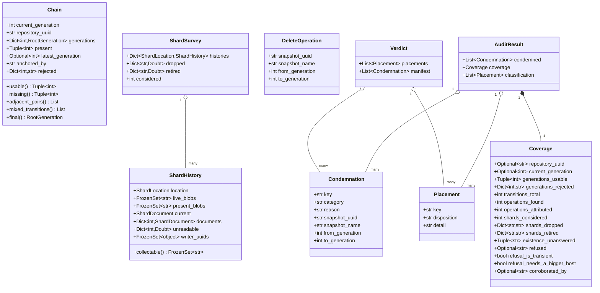

`Condemnation` is a candidate: one key, the delete operation that should have
removed it, and why. `Placement` is broader: every key the listing named gets
one, whatever it turned out to be. `Verdict.manifest` is the subset of
`Condemnation` values whose matching `Placement` came out `orphaned`, which is
the only disposition that reaches the file an operator acts on. `Coverage` is
the run's honesty check: it is what lets an operator tell "little to clean
up" apart from "could not see most of the repository," which read identically
without it.

### Credentials and delete-time shapes

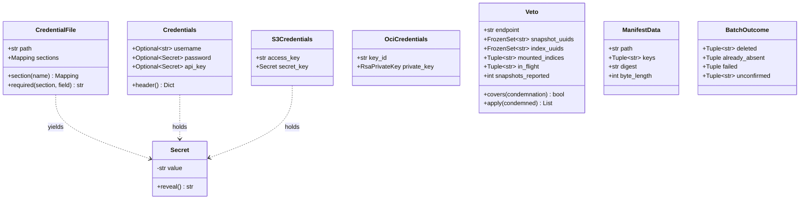

`Secret` is not a security boundary against a determined reader of the
process's own memory; it is a guard against the accident, an f-string, a
repr, a JSON dump, that would otherwise print a credential. `reveal()` has
exactly two call sites in the whole codebase, both a signing step.
`ManifestData` is read once, so its `digest` and `keys` can never drift from
a second read seeing a file that changed underneath. `BatchOutcome` is the
per-key answer for one `DeleteObjects` batch: `deleted`, `already_absent`,
`failed`, and `unconfirmed`, the last being a key that appeared in neither
the store's `<Deleted>` nor `<Error>` list, which is treated as failure, not
success, because a 200 that omits a key told this tool nothing about it.

## Shard document identity: earning trust for one read

A `BlobStoreIndexShardSnapshots` document names neither its own shard, its
own index, nor its own generation; that was confirmed against real captured
documents, not assumed. So nothing inside the bytes ties a document to the
key it was fetched under, and every document has to earn that tie from
outside itself before its file list is trusted. This runs once per shard
directory (`derivation/identity.py`, called from `derivation/shards.py`).

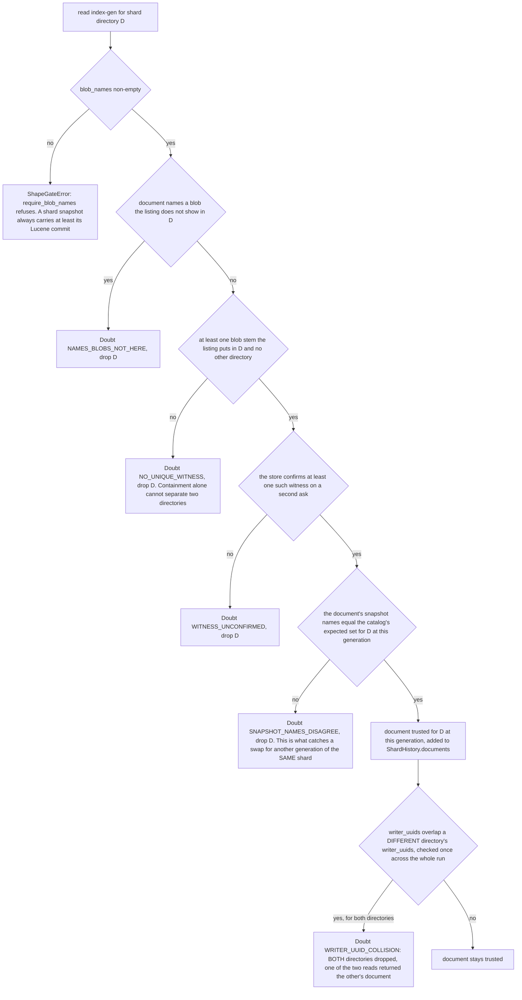

The rule this enforces is attributability, not containment. A document
naming nothing is a subset of every directory, which is why the shape gate
(`require_blob_names`) runs first and unconditionally. A document naming
only blobs another directory also holds is still not proof, because blob
names are globally unique, so a genuine document always has at least one
witness unique to its own directory; a document with none does not
distinguish this shard from any candidate it would equally fit. The writer
uuid check is the one signal that can catch a real document from a
neighbouring shard whose blobs happen to be a subset of the victim
directory's own blobs, a case attributability alone cannot see; it is
checked once, against the whole run's accumulated writer uuids per
directory, because two directories claiming the same Lucene writer identity
is a contradiction wherever in the run either was read.

## The derivation, end to end

Two flowcharts. The first is the command line's control flow, exit codes
included. The second is what happens inside `run_audit`, the single function
`derivation/audit.py` calls "the whole entry point."

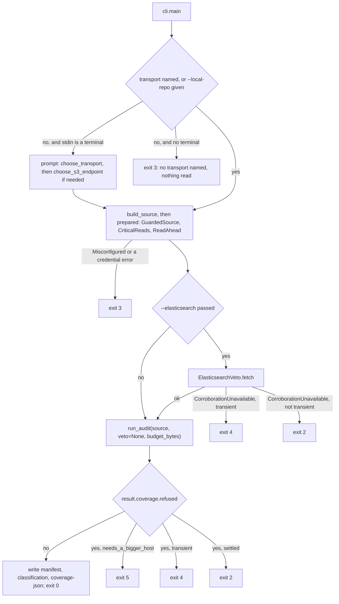

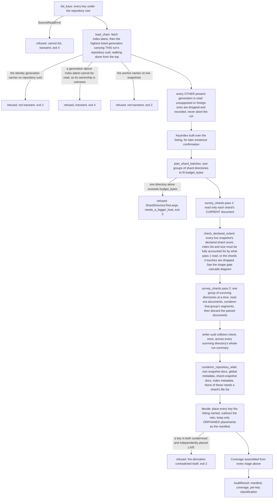

The order in the second diagram is short enough to say in one sentence, and
`derivation/audit.py`'s own module docstring says it: anchor the chain on the
highest generation that is ours, survey the shards and drop every one whose
evidence is incomplete, take Elasticsearch's own shard-local set difference,
keep the part of it some observed delete accounts for, and record everything
none of that could see. Every stage that fails records itself in coverage and
contributes nothing to the manifest.

## The condemnation decision

One key's placement, from `derivation/classification.py::_place` and
`_place_in_shard`, followed by the veto and the self-contradiction refusal in
`decide`. Only `ORPHANED` reaches the manifest.

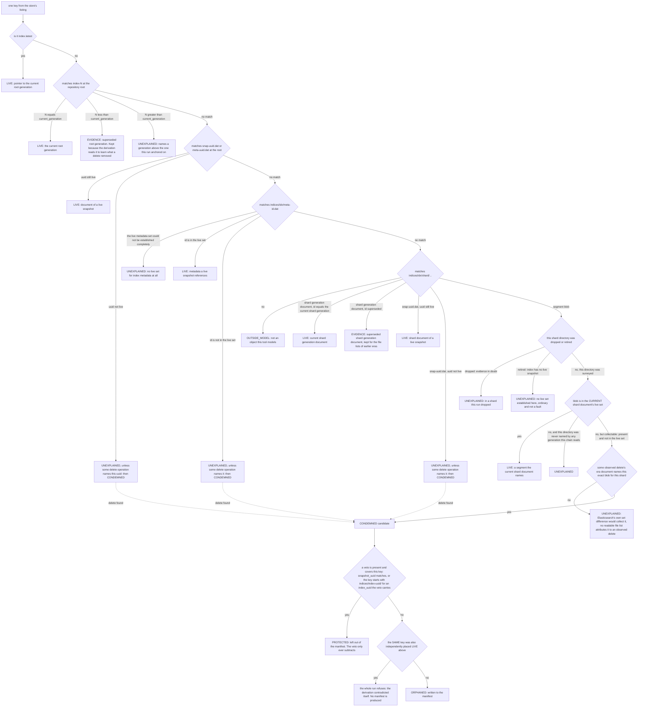

Two boundaries worth naming because an operator will overestimate them. The
veto's `index_uuids` are populated only from indices that carry an
`index.store.snapshot.*` setting, which is Elasticsearch's mark of a mounted
searchable snapshot. An ordinary live index nothing has mounted is outside
the veto entirely; only its snapshot's uuid can protect it, the same as any
other snapshot. And the contradiction check is not a normal disposition: it
is the one place the whole run refuses rather than shipping a shorter
manifest, because two readings of one live set disagreeing means a defect in
this code, not a fact about the repository.

## The shape gate cascade

Elasticsearch writes a shard document naming zero files for a snapshot entry
when it snapshots an empty shard, the window right after an index rollover
creates a fresh, still-empty backing index. The parser refuses that document.
The refusal is load bearing, and this is the cascade it sets off, measured on
the churn rig and described in `reclaim_test_protocol.py`'s own module
docstring.

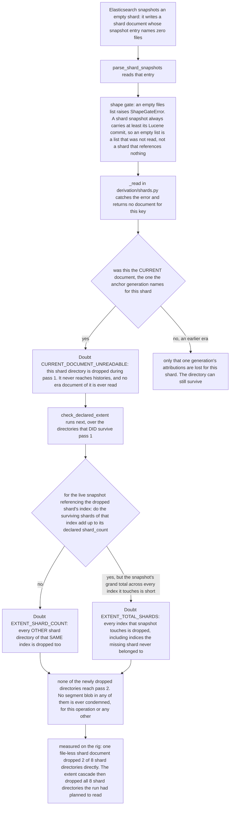

The consequence stated in `reclaim_test_protocol.py` is worth repeating
exactly: the segment path, the one with real blast radius, needs a complete
view of a shard directory, and across every campaign run before that harness
existed it condemned exactly zero objects, not because it is broken but
because a single badly timed snapshot poisons a shard directory until a
later snapshot supersedes it, and the extent check spreads that poisoning
across the snapshot's other directories. Fixing this means changing when the
rig snapshots, never relaxing the refusal: an empty shard directory might
belong to an index Elasticsearch is about to use, and the bucket alone
cannot tell the difference. The Elasticsearch veto does not cover this case
either, because it protects by snapshot uuid and by mounted-index prefix,
neither of which an ordinary empty shard has yet.

## One loop cycle: audit, dry run, approve, execute

`reclaim_test_protocol.py` drives exactly this cycle, repeatedly, against a
live repository. The important thing this diagram makes visible: the dry run
is what produces the two numbers an approval has to match.

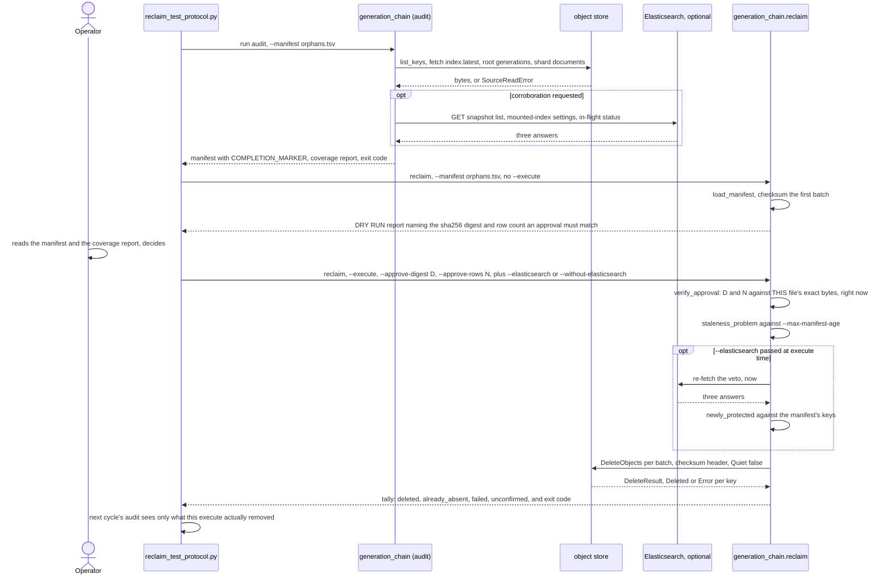

Approval binds one manifest, not a policy: `--approve-digest` is the sha256
of the exact bytes about to be acted on, so a regenerated run over the same
repository, byte for byte different, cannot be approved by yesterday's
answer. `--approve-rows` is redundant with the digest in the adversarial
sense and asked for anyway, because a hash is not a number a human notices
is wrong and a row count is.

## Manifest state machine

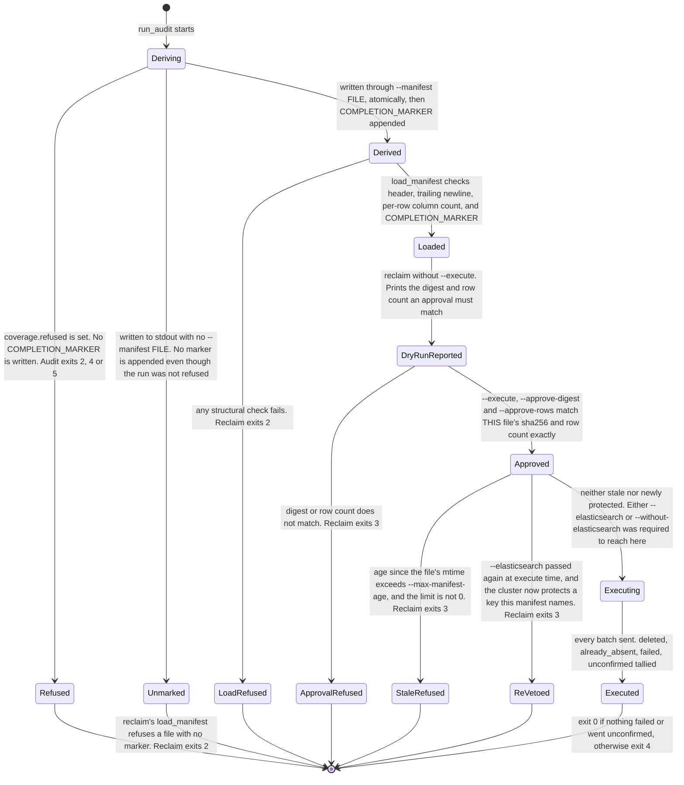

The completion marker and the approval answer two different questions, and
both have to be answered before a delete happens. The marker proves the
derivation finished; it says nothing about what happened to the file
afterward, so a manifest hand-edited after the marker was written still
reads as marked. The approval is what closes that gap: it ties a digest to
the exact bytes an operator is about to act on, so an edited or superseded
manifest fails there even when it passes the marker check.

## Exit code map

Grouped by whether a retry could ever help, taken from each tool's `--help`
and the `EXIT_*` constants in `generation_chain/cli.py` and
`generation_chain/reclaim/cli.py`.

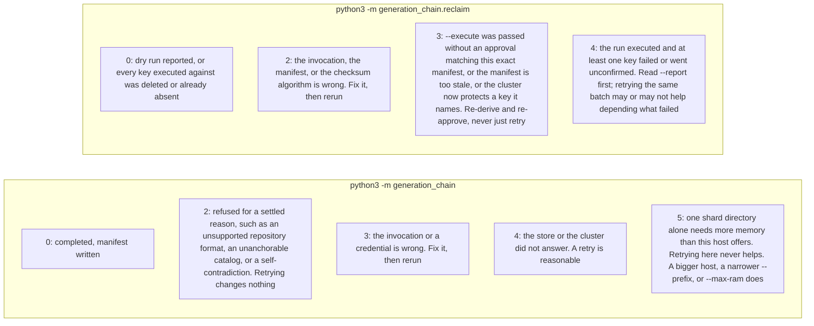

`RunRefused.transient` is what separates exit 2 from exit 4 on the audit
side, and it is a judgement this codebase states explicitly at each raise
site rather than infers from the exception type: a 5xx or 429 from a store or
a cluster is transient, an unsupported format or a self-contradiction is not.
`needs_a_bigger_host` is a second, independent flag for the same reason: a
scheduled caller reading only `transient` cannot tell "try again here" from
"try this somewhere else," and those are different instructions.

## Read-ahead and concurrency

Two wrappers sit between the derivation and a transport
(`sources/readahead.py`), on top of a shared bounded pool
(`sources/overlap.py`). Neither changes what a key answers; deleting every
`prefetch` call in the package would leave the manifest unchanged and only
make the run wait for one round trip at a time again.

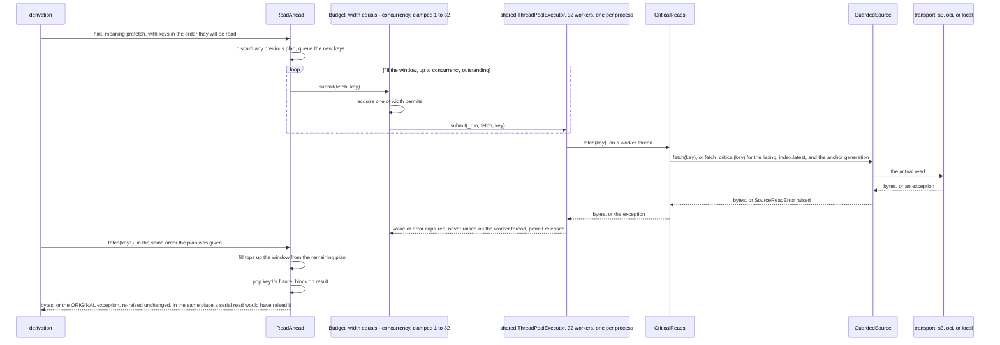

Two things are true at once and both matter to a reviewer. First, overlap
must not move the answer: work is submitted and settled by key, one thread
decides only when bytes arrive, never which bytes or which error belongs to
which key, and that is what this project's determinism tests hold. Second, exactly three reads
are escalated to a longer retry policy by `CriticalReads`: the listing,
`index.latest`, and the root generation `index.latest` names. Those three end
the whole run if they fail; everything else, a shard document, an existence
check, degrades locally and only shortens the manifest. The listing itself
has no partial form and cannot be overlapped with anything else: it is one
synchronous call that must finish before `load_chain` can even ask for
`index.latest`, so it is the one genuinely serial step at the front of every
run.

## Memory model

`--memory-mb` and `--max-ram` size `budget_bytes`, which flows into
`run_audit` and from there into `plan_shard_batches`
(`derivation/shards.py`). Without either flag, `available_bytes()`
(`sources/budget.py`) reads `/proc/meminfo` and the container's cgroup limit,
takes the smaller of the two, and keeps 80 percent of it.

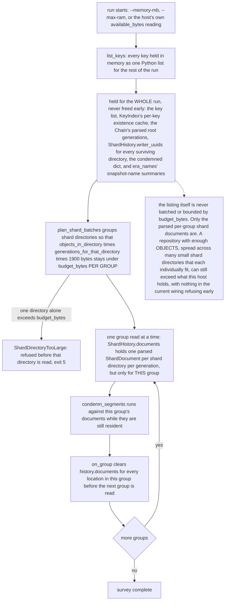

The number this is measured against, 1.9 KB resident per object, is stated
in `sources/budget.py` as linear to 585,194 objects at 1.55 GB peak, and a 2
GB host was measured to die near 750,000 objects, at the end of a thirty
minute run, with an OOM kill and no manifest. `sources/budget.py` also
defines `MemoryBudget` and `with_budget`, a wrapper meant to refuse a listing
too large for the host before a single object is read. As of this reading,
that wrapper is exercised only by this project's own tests;
`generation_chain/cli.py` never calls `with_budget` or constructs a
`MemoryBudget`, so the door check the module's own docstring describes is
not reachable from the command line today. The only active memory
protection is `plan_shard_batches`'s per-group bounding and
`ShardDirectoryTooLarge`'s refusal of one oversized directory; the whole-run
overhead the docstring warns about (the listing, the key index, the chain)
is not bounded by `--memory-mb` or `--max-ram` at all. This gap is the one
[testing-in-your-oci-environment.md](../testing-in-your-oci-environment.md)
tracks as a real, open limitation, upstream issue 7: memory use scales with
object count, and `--memory-mb` today only makes the shard-batching refuse
before it reads rather than fail partway through, not the run as a whole.

## Existence is three-valued

A smaller diagram, added because it is the one measured place this tool's
own report was found to be wrong rather than merely conservative, and it
feeds both the identity witness check above and every root-level
condemnation that tests `key in keys`.

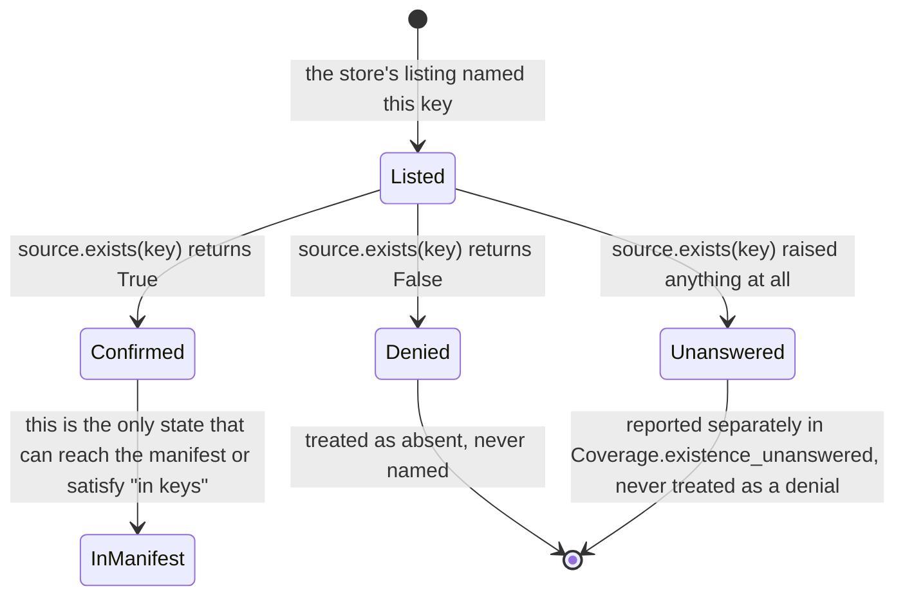

`KeyIndex` (`derivation/keys.py`) caches this per key for the run. The
retired predecessor caught every exception from the existence check and
recorded it as a denial, which folded "the store said no" and "the store
could not answer" into one value; measured against a store failing 1 in
1000 checks, about 31 of 30,938 keys silently left a 100-percent-coverage
report. Keeping `Unanswered` separate does not change which keys reach the
manifest, since only `Confirmed` does either way; it changes whether an
operator reading the coverage report can tell a clean repository from one
this run could not finish asking about.
