# Architecture

This page is the structural view of `elasticsearch-oci-s3-workaround`: what
runs, where it runs, what talks to what, over which protocol, and who can
mutate remote state. It does not cover how the derivation algorithm decides
a blob is orphaned, or how the delete batching works internally; that is
[`algorithms.md`](algorithms.md). It does not cover the threat model,
attacker capabilities, or the guard rationale in detail; that is
[`../security/threat-model.md`](../security/threat-model.md). Where this page
would naturally slide into either, it links out instead.

Derived by reading the code, not by reading a diagram someone drew once
before. Diagrams are Mermaid, dated to commit `9821cfa8` on `main`,
2026-08-27. They will drift the moment either the package layout or the
chart changes; re-derive rather than trust an old diagram once that happens.

Mermaid was **not machine-verified**. `npx @mermaid-js/mermaid-cli` on this
host resolves to the Windows install through WSL interop and fails on the
UNC path before it can render anything (`CMD.EXE was started with the above
path as the current directory. UNC paths are not supported.`), which is the
known WSL failure mode, not a diagram problem. Every diagram below was
hand-checked against the syntax rules instead: quoted labels wherever a
label contains a paren, colon, slash, comma or quote; no bare `end` as a
node id; `flowchart` rather than the older `graph` keyword.

## 1. System context

The four executables that get confused with each other, and what each one is
allowed to touch. `generation_chain` is the audit: it can only read.
`generation_chain.reclaim` is the only one of the four that can delete, and
only after a human has read a manifest the audit wrote. `reclaim_test_protocol.py`
drives both of those, cycle after cycle, as a qualification loop.
`snapshot_churn_rig.py` manufactures the very thing this project exists to
clean up, so there is something to test against.

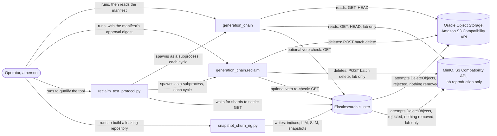

Read the bottom two edges first, because they are the fault this whole
project exists for: Elasticsearch believes it deleted, and the store refused
the request. Everything above them is this project's answer, kept in two
pieces on purpose. Only one box in this diagram can mutate the object
store, and it is never the one on a schedule; see
[the connection diagram](#4-connections-protocols-and-who-can-mutate-what)
for the method-level detail behind "reads" and "deletes" here.

This diagram simplifies one thing: `generation_chain` also supports
`--transport oci` (Oracle's native Object Storage API, a different
credential and a different signature scheme) and `--transport local` (a
mirrored directory on disk, no network at all). Both are read paths with the
same read-only guarantee as the Amazon S3 Compatibility API shown here. The
[connection diagram](#4-connections-protocols-and-who-can-mutate-what) lists
them.

Two auxiliary tools are deliberately left off this diagram because they are
one-way and lower-stakes than the four above: `snapshot_sizes.py` only reads
Elasticsearch, and `verify_restorable.py` only reads Elasticsearch and
restores into it to prove a snapshot is real. Neither touches the object
store, and neither is one of the four tools operators confuse.

## 2. Component structure of `generation_chain/`

Traced from the actual `import` and `from ... import` lines in every module
under `generation_chain/`, not from directory names. Four sub-diagrams: a
package-level overview, then the three subpackages the task called out by
name, each of which has real internal structure worth seeing on its own
rather than collapsed into one box.

### 2a. Package overview

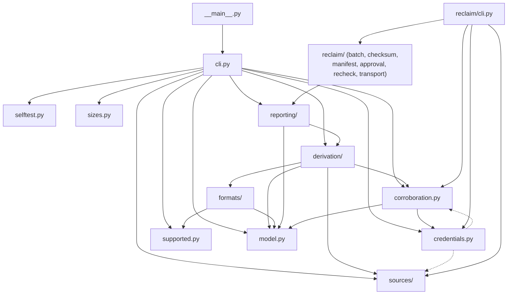

Read the two dashed edges from `credentials.py` as what they are: lazy,
function-local imports used only for type hints and for building a
`sources.s3.S3Credentials` or `sources.oci.OciCredentials` on demand, not a
module-load-time dependency. Everything else is a real top-level import.
Two things worth an architect's attention here. First, `reclaim/` is its own
subtree hanging off `reclaim/cli.py`; nothing under `derivation/`,
`sources/`, or `formats/` imports anything under `reclaim/`, which is the
source-level proof behind the claim in `generation_chain/README.md` that the
audit "has no delete path." Second, `model.py` and `errors.py` (omitted
above because every single module in the package imports `errors.py`, which
would make it a hairball rather than a diagram) are the only two leaves:
nothing in `generation_chain/` imports back up into `cli.py` or
`derivation/`.

### 2b. `derivation/` internals

This is the package that computes the set difference and decides what goes
in the manifest. The algorithm itself is [`algorithms.md`](algorithms.md);
this is only which module calls which.

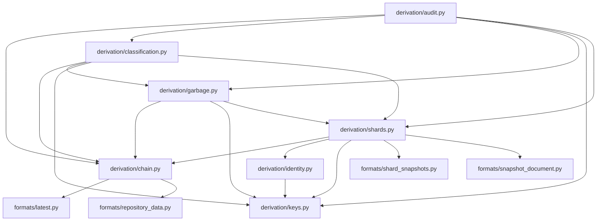

`audit.py` is the one place every other module in this subpackage gets
joined, matching what `generation_chain/README.md` says about it being the
whole entry point (`run_audit`). `keys.py` sits at the bottom of the
subpackage's own dependency order, imported by every other module here and
importing none of them back (its one internal import, `sources.RepositorySource`,
is guarded behind `TYPE_CHECKING` and never runs). `identity.py` is reached
only through `shards.py`, which matches the design document's claim that
identity establishes whether a shard document belongs to the directory it
was found in, a question only `shards.py` needs answered.

### 2c. `sources/` internals

Three transports, a shared HTTP floor, and read-ahead scheduling. This is
also where the read-only guarantee actually lives in code, not just in
documentation.

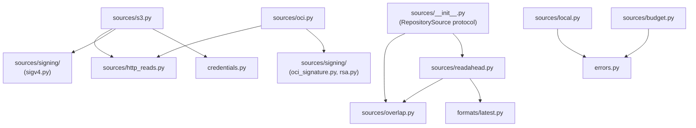

`sources/http_reads.py` is the module that actually enforces the read-only
promise: `ALLOWED_METHODS = frozenset({"GET", "HEAD"})`, checked by an
`assert` in both `s3.py`'s and `oci.py`'s own `_request` methods before a
request is built. There is no `POST` in this subpackage at all, in either
transport. One documentation note worth flagging here rather than burying
it: `gitlab/readonly-scan/.gitlab-ci.yml`'s header comment and the audit
CronJob's template comment both describe the audit's transport as permitting
"GET and HEAD, and the one POST that lists a bucket." The code disagrees.
Bucket listing is `GET` with `list-type=2` in the query string
(`sources/s3.py`, `list_keys`), not a `POST`. The only `POST` anywhere in
this codebase is in `reclaim/transport.py`, the batch-delete request, which
is not part of the audit at all. The safety property the comment is trying
to state (the audit cannot delete) is still true; the specific mechanism
described is not what the code does.

`local.py` is the odd one out: no network, no signing, reads a directory
tree that mirrors a bucket layout, and its only internal dependency is
`errors.py`. It is what `--transport local` and `--local-repo` use, and it
is also what the offline self-test and the CI-friendly parts of the test
suite drive instead of a live store.

### 2d. `reclaim/` internals

The only subtree in the package with a delete path. Kept structurally
separate: nothing under `derivation/`, `formats/`, `sources/`, or
`reporting/` imports anything from here, and this subtree does not import
`derivation/` either.

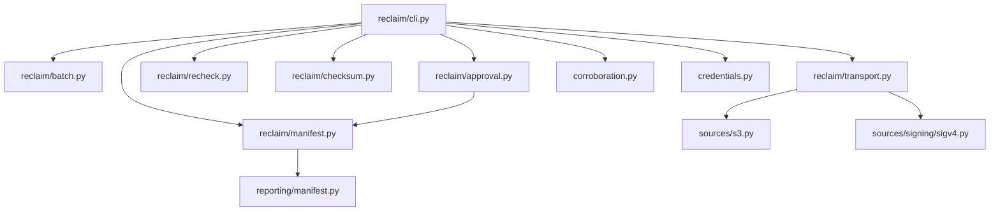

`transport.py` carries its own module docstring making the isolation
explicit: it is "the one place in this project authorised to send something
other than GET or HEAD," does not import `sources/http_reads.py`, and is
never imported from `derivation/`, `sources/`, or `reporting/`. That claim
is checkable directly against the import list in
[Section 2a](#2a-package-overview): nothing outside `reclaim/` points at
`reclaim/transport.py`. `checksum.py` has no internal dependency at all
beyond `errors.py`; it is pure computation over bytes, which is why it can
carry the four checksum algorithms (`md5`, `crc32`, `crc32c`, `sha256`) as
data rather than as branches scattered through the request-building code.

## 3. Deployment topology, three ways

The same four executables, three different places they get run from.

### 3a. Operator running it by hand

The shortest path, and the one every quickstart in this repository assumes.
No orchestration, no cluster; one host, one shell, one credentials file.

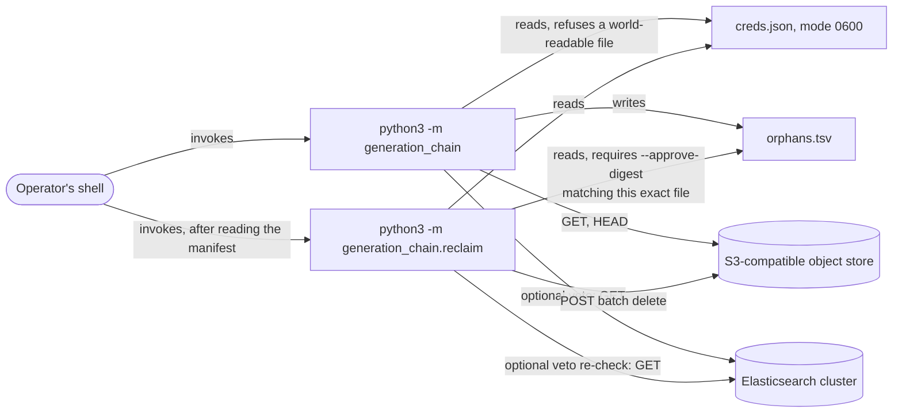

Nothing here is provisioned; both processes exit when the run finishes.
`creds.json` is the one piece of durable state on the host, and both
`docs/quickstart-read-only.md` and the top-level `README.md` are explicit
that it must be `chmod 600` or the tool refuses to start rather than read
it. The manifest file is the trust boundary between the two processes: the
audit writes it, a human is expected to read it, and the reclaim tool
verifies a sha256 digest of its exact bytes before it will act on it. See
[Section 7](#7-the-manifest-and-approval-as-the-delete-gate) for that
handoff in more detail.

### 3b. The Kubernetes chart

`gitlab/kubernetes-test-rig/chart/` deploys this as five workload kinds in
one namespace: a scheduled `CronJob` for the audit, plain `Job`s for the
load generator and the qualification loop, and a Helm `pre-delete` hook
`Job` for teardown. An `initContainer` chain, shared by every pod, clones
the tool's source and stages its credentials before any tool runs.

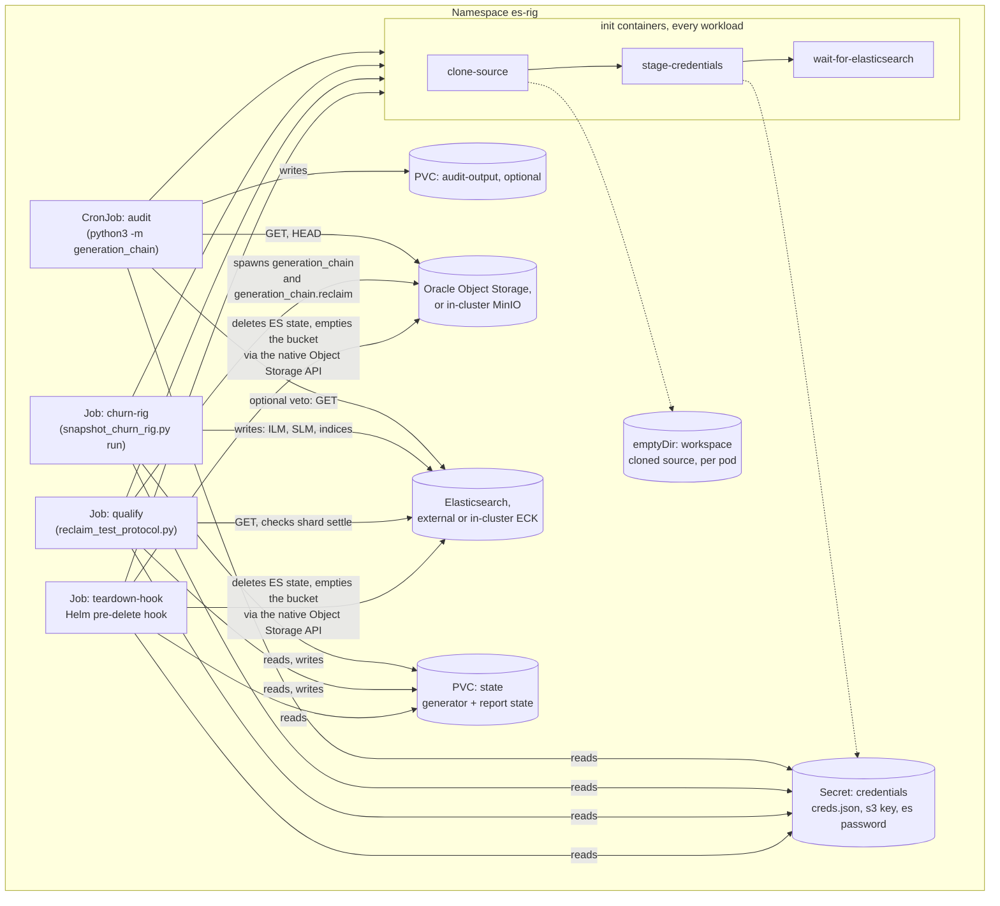

Three things an architect should take from this one. First, every pod that
touches a credential runs the same three init containers in the same order;
`stage-credentials` exists purely because a Kubernetes `Secret` volume is
owned by `root` and every one of these tools refuses a credentials file
looser than `0600`, so a root-owned init container copies it into an
`emptyDir` and `chown`s it to the runtime uid (1001, matching the UBI base
image) before the real container starts. Second, `qualify` is the only Job
that can delete anything, and it is `values.yaml`'s own `qualify.dryRunOnly`
flag, not a Kubernetes construct, that gates whether its cycles ever pass
`--execute` to `generation_chain.reclaim`; the chart never invokes
`generation_chain.reclaim` directly. Third, the `audit` CronJob is the one
workload here safe to leave running unattended, which is exactly why it is
the one built as a `CronJob` and `qualify` is deliberately a plain `Job`.
[Section 6](#6-sync-and-startup-ordering) covers the ordering between these
pieces; this diagram is only the topology.

### 3c. The two GitLab pipelines

Two self-contained pipelines under `gitlab/`, meant to be copied into an
operator's own project. They are not variants of each other: one is
structurally incapable of deleting, and the other deploys the same Helm
chart from Section 3b.

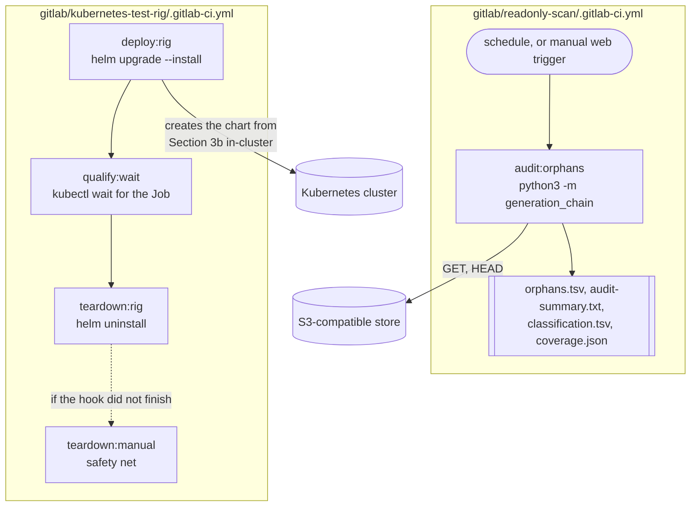

`readonly-scan` runs `rules: - if: $CI_PIPELINE_SOURCE == "schedule"` with no
`when: never` guard, and it is the pipeline the top-level `gitlab/README.md`
explicitly recommends putting on a schedule, because there is no `--execute`
flag on `generation_chain` for a compromised or misconfigured schedule to
reach. `kubernetes-test-rig` does the opposite on purpose: every job in it
carries `if: $CI_PIPELINE_SOURCE == "schedule" / when: never`, so this
pipeline structurally cannot be triggered by a cron schedule at all, only by
a person clicking "run pipeline." `gitlab/README.md` states the reasoning
directly: "the thing capable of deleting is never the thing on the easy
path, or the schedule." Note also that a third, separate `.gitlab-ci.yml`
lives at the repository root; it is this project's own dogfooding pipeline
(it runs `snapshot_churn_rig.py` and the qualification loop directly
against a real Oracle bucket, without Kubernetes) and is not one of the two
templates meant for an operator to copy, so it is not diagrammed here.

## 4. Connections, protocols, and who can mutate what

Every network edge in the system, gathered into one table because a
diagram with this many distinct auth schemes stops being legible as boxes
and arrows. **Mutates** means the edge can change state at the far end;
everything else is read-only from that process's point of view.

| From | To | Protocol / method | Auth | Mutates? |
|---|---|---|---|---|
| `generation_chain` (`--transport s3`) | Amazon S3 Compatibility API (Oracle, MinIO) | HTTPS, `GET`/`HEAD` only (`sources/http_reads.py` `ALLOWED_METHODS`) | SigV4, Customer Secret Key / access key pair | No |
| `generation_chain` (`--transport oci`) | Oracle Object Storage native API | HTTPS, `GET`/`HEAD` only, same `ALLOWED_METHODS` | OCI request signing, RSA key pair from `~/.oci/config` | No |
| `generation_chain` (`--transport local`) | local filesystem mirror | filesystem read | none | No |
| `generation_chain` (`--elasticsearch`) | Elasticsearch | HTTPS/HTTP, `GET` | API key (`Authorization: ApiKey`) or HTTP basic | No, veto only removes manifest entries |
| `generation_chain.reclaim` | Amazon S3 Compatibility API | HTTPS, `POST /<bucket>?delete`, `Content-MD5` or `x-amz-checksum-*` | SigV4, Customer Secret Key | **Yes, deletes objects** |
| `generation_chain.reclaim` (`--elasticsearch`) | Elasticsearch | HTTPS/HTTP, `GET` | API key or HTTP basic | No, re-checks the veto, never writes |
| `reclaim_test_protocol.py` | `generation_chain`, `generation_chain.reclaim` | local subprocess (`sys.executable -m ...`) | inherits the harness's own credentials file | Indirect, via the reclaim subprocess |
| `reclaim_test_protocol.py` | Elasticsearch | HTTPS/HTTP, `GET` | its own `--es-user`/`--es-password-file`, separate from the audited cluster credential | No |
| `snapshot_churn_rig.py run` | Elasticsearch | HTTPS/HTTP, `PUT`/`POST`/`DELETE` (indices, ILM, SLM, snapshots) | `--user`/`--password-file` | **Yes, this is its job** |
| `snapshot_churn_rig.py teardown` | Elasticsearch | HTTPS/HTTP, `DELETE` (its own state only) | same credential as `run` | **Yes, but scoped to its own `--prefix`** |
| `snapshot_churn_rig.py` (`--s3-*` listing flags) | S3-compatible store | HTTPS, `GET` (object count / leak measurement only) | access key / secret key file | No |
| Elasticsearch's own S3 repository client | the S3-compatible store | HTTPS, `PUT`/`POST` (snapshot writes) and `POST ?delete` (the failing call) | S3 client secure settings (`s3.client.*.access_key`/`secret_key`) | Yes for writes; the delete is attempted and rejected |
| GitLab CI runner (`readonly-scan`) | the audit process | local process spawn, `File`-type CI/CD variable for credentials | GitLab-managed variable, written to disk with `install -m 600` | No |
| GitLab CI runner (`kubernetes-test-rig`) | Kubernetes API server | `kubectl`/`helm`, cluster kubeconfig | CI runner's own cluster credential | Yes, creates/deletes the chart's resources |
| Helm chart `clone-source` init container | the tool's own git repository | `git clone --depth 1` over HTTPS or SSH | none (public repo) or `existingSshSecret` | No |

Exactly two rows in this table can remove bytes from the object store:
`generation_chain.reclaim`'s batch delete, and Elasticsearch's own repository
client sending the request that this whole project exists because the store
rejects. Everything else in the system either cannot reach the store at all,
can only read it, or (the churn rig) can only write new objects, never
remove the ones it wrote through the normal repository client path.

## 5. The fault itself

Working path against genuine AWS S3 or a compliant store, versus the failing
path against Oracle Object Storage's Amazon S3 Compatibility API, MinIO
before its January 2025 fix, and the other stores in the same blast radius.
Full mechanism, version boundary, and upstream history are in the top-level
`README.md`'s "The failure in detail"; this is the shape of it as a diagram.

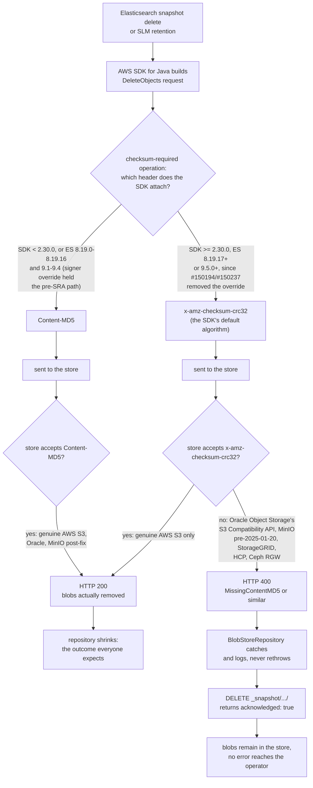

The branch point that matters is the single diamond in the middle:
`x-amz-checksum-crc32` is the SDK's default alternative to `Content-MD5`,
and it happens to be the one algorithm Oracle's Amazon S3 Compatibility API
does not accept for this operation (it accepts `Content-MD5`,
`x-amz-checksum-sha256`, and `x-amz-checksum-crc32c`, measured directly
against a live Oracle bucket and recorded in
[`evidence/oci-s3-compatibility/README.md`](../../evidence/oci-s3-compatibility/README.md)).
Nothing about the delete algorithm inside `generation_chain/` is on this
diagram; that box is the thing `generation_chain` is compensating for from
outside the cluster, and `generation_chain.reclaim` sends `Content-MD5` by
default specifically because that is the one algorithm every affected store
this project has measured will accept (`reclaim/checksum.py`).

## 6. Sync and startup ordering

Helm and Argo CD both create every templated resource in one pass; ordering
inside that pass is what sync waves, init container order, and hook weights
control. Three separate ordering mechanisms are at work in the chart, and
conflating them is the mistake this diagram exists to prevent.

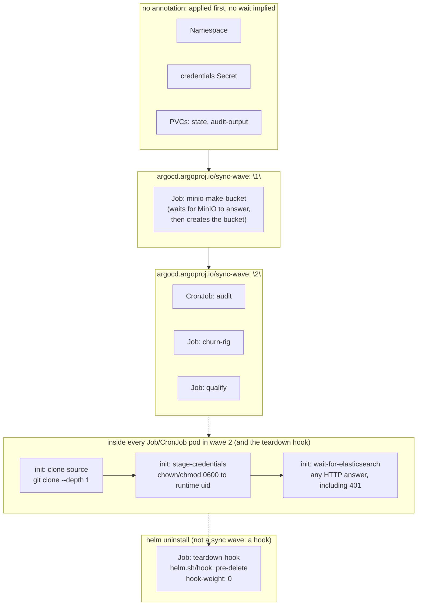

The wave-1 `minio-make-bucket` Job carries a comment in the chart worth
repeating here because it is easy to get backwards: it is deliberately
**not** a Helm `post-install` hook. A `post-install` hook only runs once
Argo reports the release `Healthy`, and the release cannot become healthy
while the audit and qualify workloads are failing for want of the bucket
this Job creates, so the two would wait on each other forever. An ordinary
wave-1 resource sidesteps that deadlock, and the wait loop inside the Job
itself (polling MinIO's health endpoint) covers the plain `helm install`
case, where sync waves do not apply at all.

The teardown hook is not a sync wave either; it is a Helm lifecycle hook
(`pre-delete`), which only fires on `helm uninstall`, never on install or
upgrade. It has to be pre-delete rather than post-delete specifically
because it reads `--state-file` off the `state` PVC, and a post-delete hook
would run after Helm had already deleted that PVC along with the rest of
the release. `hook-delete-policy: before-hook-creation,hook-succeeded`
means a stale hook Job from a previous failed uninstall is cleaned up before
a new one is created, so retrying an uninstall does not collide with the
Job it left behind.

## 7. The manifest and approval as the delete gate

Not on the original list, and added because it is the one structural
mechanism that makes every deployment topology in Section 3 safe in the same
way. The audit and the delete tool are separate operating-system processes
in every topology (a shell, a Kubernetes pod, a CI job), and the only thing
that crosses that process boundary is a file plus two numbers. An architect
signing off on this system needs to see that boundary as a diagram, not just
read that it exists in prose.

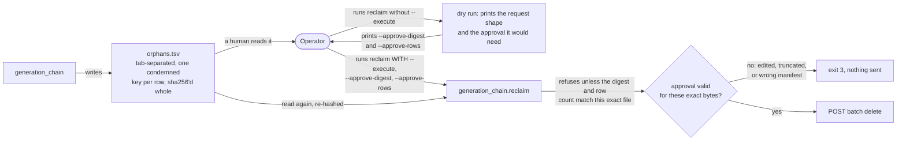

Two properties fall out of this shape rather than out of any single check.
Editing the manifest after the dry run invalidates its own approval, because
the digest is computed over the file's exact bytes; there is no
"approve this many rows" without "approve this exact content." And the
approval is meaningless without a prior dry run to have produced it, because
`--approve-digest` is not a value an operator can invent, it has to come
from a run of `generation_chain.reclaim` against that same file. What this
diagram does not cover is the manifest's *age*: `reclaim/recheck.py` layers
a separate, time-based check on top of this one
(`--max-manifest-age`, default one hour) because the approval above says
nothing about whether the cluster has changed since the manifest was
derived. That staleness check, and the Elasticsearch veto it re-runs, are
algorithm-level behavior and belong in
[`algorithms.md`](algorithms.md), not here.

## Scope and what this page leaves out

This page does not cover: the derivation algorithm's set-difference logic,
the shard-completeness gates, or the delete batching and retry logic inside
`reclaim/batch.py` and `reclaim/transport.py` (all in
[`algorithms.md`](algorithms.md)); the threat model, attacker capabilities,
or the reasoning behind any individual guard
([`../security/threat-model.md`](../security/threat-model.md)); the on-disk
repository format Elasticsearch writes, covered structurally rather than
architecturally in
[`repository-layout-and-reachability.md`](../repository-layout-and-reachability.md);
and the byte-level accounting of what a wrong delete costs, in
[`blast-radius.md`](../blast-radius.md). Diagrams here were derived against
commit `9821cfa8` on `main`; re-derive them after a change to package
layout, chart templates, or CI pipeline structure rather than trust them
past that point.
