# Threat model

This document is for a security engineer deciding whether to run this tool
against a production snapshot repository. It covers trust boundaries,
credential handling, attack surface, blast radius and the controls that sit
between a mistake and data loss.

It does not restate the scan results in
[evaluation-report.md](evaluation-report.md), the control-by-control mapping
in [asd-stig-assessment.md](asd-stig-assessment.md), or the organisational
questions in [what-we-need-from-you.md](what-we-need-from-you.md). Read
those first if you have not. This document assumes their conclusions and
draws the pictures they do not: what crosses which boundary, what an
attacker or a mistake would have to defeat at each step, and where the
controls stop.

Structure and control flow live in
[../engineering/architecture.md](../engineering/architecture.md) (system
context, components, deployment) and
[../engineering/algorithms.md](../engineering/algorithms.md) (data
structures, the derivation algorithm, refusal behaviour). Where a diagram
here needs a structural detail, it links there rather than repeating it.

The premise, stated once because every diagram below assumes it: this tool's
one destructive action is a batch `DeleteObjects` call against an object
store that offers no `ListObjectVersions` on its S3 compatibility API.
There is no undo through that API. A wrong delete is gone. Everything here
is organised around that one fact.

## How to read the diagrams

Every diagram is a GitHub-flavoured Mermaid fenced block. They were not
machine-rendered in this environment: no Mermaid CLI is reachable from this
sandbox (a Node-on-Windows `npx` reachable through WSL interop cannot resolve
a WSL filesystem path, and no native Linux Node is installed). Each diagram
was instead hand-checked against Mermaid's GitHub-rendering constraints:
every label with a paren, colon, slash, quote or comma is double-quoted, no
node id is a reserved word, no angle brackets appear anywhere (a literal
`<uuid>` placeholder reads as an HTML tag to Mermaid's renderer and can
silently eat the rest of a label, so every such placeholder below is spelled
`UUID`, `INDEX_UUID`, `REPO`, and so on instead). If one still fails to
render, treat that as a bug in this document and open an issue against it.

## 1. The four ways this is used

This tool runs four different ways, and each one has a different threat
surface. That fact is scattered through the rest of this document: the
zones live in the trust-boundary diagram in the next section, the
credential paths live in section 3, and the deployed shape lives in
section 10. A reader who wants to know "I am doing X, what am I exposed
to" cannot get that answer from any single place today. This section
states the four plainly, once, before the rest of the document works
through the pieces.

The four are: a person running the audit, and separately the delete
tool, by hand; the audit running unattended in a GitLab worker; the
churn rig running for hours inside Kubernetes; and the audit running
unattended on a timer inside Kubernetes. They differ in which of
the four executables run, which credential each one holds, whether a
delete path exists at all, and whether a human looks at anything before
something destructive happens. What follows starts with the boundary
between the audit and the delete tool on disk, since all four modes are
built from those same two entry points, then works through each mode in
turn, then compares them. The "Residual risk" section at the end
attributes each risk it names to the mode it actually lands on.

### The audit / delete module boundary

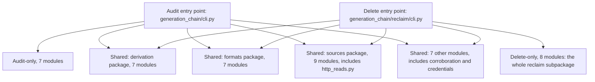

**What this shows.** Two entry points, `generation_chain/cli.py` for the
audit and `generation_chain/reclaim/cli.py` for the delete tool, statically
traced for their full import closure. 7 modules load only under the audit
(`cli`, `reporting`, `reporting.coverage`, `selftest`, `sizes`,
`sources.local`, `sources.overlap`). 8 modules load only under the delete
tool, and they are the entire `reclaim` subpackage (`reclaim`,
`reclaim.approval`, `reclaim.batch`, `reclaim.checksum`, `reclaim.cli`,
`reclaim.manifest`, `reclaim.recheck`, `reclaim.transport`). 30 modules
load under both, grouped above by subpackage: the derivation package
(`derivation.audit`, `derivation.chain`, `derivation.classification`,
`derivation.garbage`, `derivation.identity`, `derivation.keys`,
`derivation.shards`), the formats package (`formats.codec`,
`formats.latest`, `formats.lucene_segments`, `formats.repository_data`,
`formats.shard_snapshots`, `formats.smile`, `formats.snapshot_document`),
the sources package including signing (`sources`, `sources.budget`,
`sources.http_reads`, `sources.oci`, `sources.s3`, `sources.signing`,
`sources.signing.oci_signature`, `sources.signing.rsa`,
`sources.signing.sigv4`), and seven more standing on their own
(`corroboration`, `credentials`, `errors`, `generation_chain`, `model`,
`reporting.manifest`, `supported`).

The boundary is asymmetric, and the asymmetry is the point. The audit
does not reach `reclaim` at all: no arrow above runs from `AuditEntry` to
`ReclaimOnly`, and that absence is not just a reading of the import graph,
it is a named, pinned test in this project's own suite, a guard case called
`the-audit-path-never-imports-reclaim`; removing the line that
enforces the separation turns that named case red. But the delete tool
imports the derivation package, the formats package, the whole sources
package, and everything else the audit imports too. Thirty of the
forty-five modules this project ships are reachable from both processes.
A defect in `generation_chain/derivation/classification.py` or
`generation_chain/sources/s3.py` is a defect in both the audit and the
delete tool at once. A defect in `generation_chain/reclaim/batch.py` is
reachable from neither the audit process nor any pipeline that only runs
the audit, because that module is never loaded there.

`generation_chain/sources/http_reads.py`, the module that enforces
GET-and-HEAD-only (section 7 covers what it refuses and why an `assert`
was not enough), is in the shared list: both processes load it, and both
are bound by it for their own reads. `generation_chain/reclaim/transport.py`,
the module that builds and signs the one `POST /bucket?delete` request
this project can send, is in the delete-only list. That is the concrete,
code-level reason the audit cannot delete anything: not a flag it
declines to expose, but a module it never loads. The four modes below
are all built from these same two entry points; what changes between them
is who runs which one, what credential they hold when they do, and
whether anything human looks at the result first.

### Mode 1: standalone, at a prompt

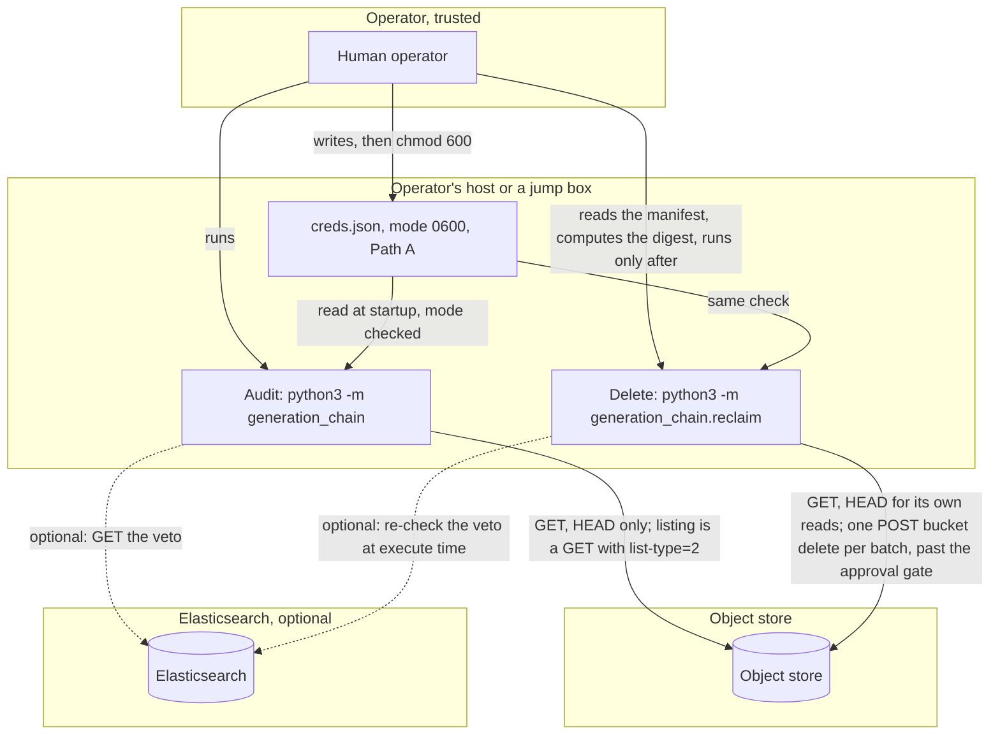

**What runs, and what it is allowed to do.** Either or both of the audit
and the delete tool, invoked by hand, typically on the operator's own
machine or a jump box they have shell access to. This is the only mode
where a human runs the delete tool directly, and where the delete path is
reached the way the tool intends it to be reached: dry run first, then a
separate, deliberate `--execute` invocation.

**Which credential it holds and how it arrives.** Path A: a `creds.json`
file the operator writes and `chmod 600`s themselves, on local disk. See
section 3 for the full path, including the window between write and
`chmod` where the file is briefly readable by whoever else is on the
host.

**Who reviews before a destructive action.** A human, and this is the
mode with the strongest version of that step in the whole document: the
operator reads the manifest and the dry run's report, independently
computes the sha256 and row count, and types both into the command line
that runs `--execute`. Nothing else in this document has a human this
close to the bytes being approved.

**What an attacker gains by compromising this mode.** Everything the
operator has, at the moment they have it. An attacker with code
execution on this host does not need to defeat the approval mechanism;
they can read the same manifest the operator would, compute the same
sha256 the operator would, and run the same `--execute` command, because
the check verifies the bytes, not the person typing them. Whatever
credential is on that host, whatever cached profile or SSH access lets
the operator reach the bucket or the cluster, the attacker now has too.

**What is different about this mode.** It is the only one with a real
human-judgment step, and it is also the mode with the weakest
infrastructure isolation: no shared-runner boundary, no namespace RBAC,
no pipeline `rules:` block standing between a person and `--execute`.
The strength of the review and the weakness of the isolation are the
same fact seen from two sides: this mode trusts the operator's judgment
because it has nothing else to trust.

### Mode 2: the audit in a GitLab worker

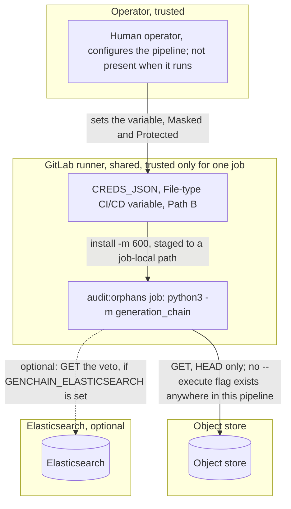

**What runs, and what it is allowed to do.** Only the audit, `python3 -m
generation_chain`, run by the `audit:orphans` job defined in
`gitlab/readonly-scan/.gitlab-ci.yml` and pulled in by the root
`.gitlab-ci.yml`'s `include:`. There is no delete path in this mode at
all: `reclaim/` is never imported (see the module-boundary diagram
above), there is no `--execute` flag anywhere in this pipeline file, and
nothing in this job's script could build one even if a variable were set
wrong. Absent, not disabled.

**Which credential it holds and how it arrives.** Path B: `CREDS_JSON`, a
File-type CI/CD variable GitLab writes to a job-local path when the job
starts, then `install -m 600` fixes the mode before this tool ever opens
it. See section 3 for the caveat that matters here specifically: the file
exists in plaintext on runner-local disk for the job's duration, and
anyone else with shell access to that shared runner while the job runs
can read it.

**Who reviews before a destructive action.** Nobody, and that is
acceptable, because there is no destructive action in this mode to
review. The pipeline runs unattended by design, on a schedule,
precisely because nothing this job can do needs a human present to catch
it.

**What an attacker gains by compromising this mode.** Whatever they can
reach while inside a job's window on a shared runner: the store
credential and, if configured, the Elasticsearch read credential, both
in plaintext for the job's duration. What they cannot get from inside
this process is a delete: `ALLOWED_METHODS` in
`generation_chain/sources/http_reads.py` permits only `GET` and `HEAD`,
checked before every request leaves the process (section 7). What they
can still do is walk off with the credential material itself and use it
from a different client entirely; whether that succeeds depends on the
IAM policy attached to the key, not on this pipeline, which is the same
gap section 7 names for every mode.

**What is different about this mode.** Nothing here is defaulted.
`GENCHAIN_ENDPOINT`, `GENCHAIN_REGION`, `GENCHAIN_BUCKET`, and
`GENCHAIN_PREFIX` all ship empty, and the job's own preflight check
refuses and names exactly what is missing rather than resolving to a
placeholder that happens to point somewhere. This is the only mode where
fail-closed configuration is doing real work in place of a human: a
misconfigured pipeline stops instead of quietly auditing the wrong
bucket, because nobody would be watching for it to explain itself
otherwise.

### Mode 3: the churn rig in Kubernetes

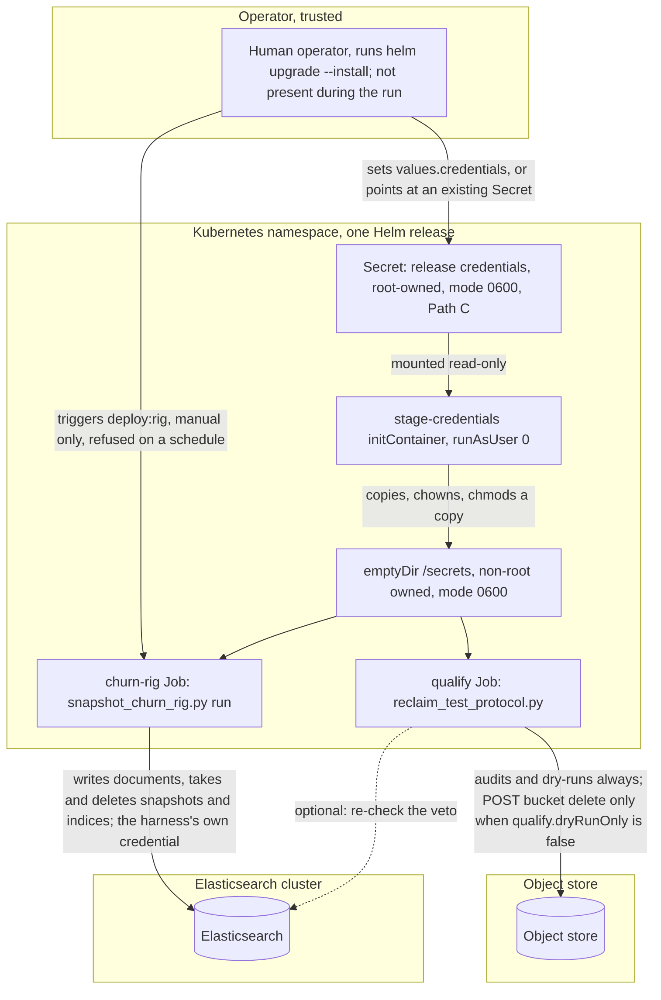

**What runs, and what it is allowed to do.** All four executables can be
in play at once: the churn-rig Job (`snapshot_churn_rig.py run`) mutates
the cluster for hours, writing documents, rolling ILM/SLM policies over a
data stream, and manufacturing a leaking repository on purpose; the
qualify Job runs `reclaim_test_protocol.py`, which drives the audit and,
when told to, the delete tool, cycle after cycle. The delete path exists
in this mode when `qualify.dryRunOnly` is explicitly set to `false` in a
values file; the default is `true`, dry-run-only.

**Which credential it holds and how it arrives.** Path C: a Kubernetes
Secret, rendered by
`gitlab/kubernetes-test-rig/chart/templates/credentials-secret.yaml`,
mounted read-only at 0600 and root-owned, staged by a root-run
`stage-credentials` initContainer into a non-root-owned `emptyDir` copy
at the same mode, because the Secret volume itself is unreadable to the
non-root main container. See section 3 for the full path, including the
point that whether the Secret is encrypted at rest depends on the
cluster's own etcd configuration, which this chart does not control.
This mode also holds a second, separate credential the other two modes
do not: the harness's own Elasticsearch login
(`credentials.harnessEsPassword`), used by the churn rig and by
`reclaim_test_protocol.py`'s own cluster setup calls, kept apart from the
`elasticsearch` section the audit and delete tools use for the veto.

**Who reviews before a destructive action.** Nobody, and that is the
risk, not an acceptable absence the way it is in mode 2.
`reclaim_test_protocol.py` scrapes `--approve-digest` and `--approve-rows`
straight out of the dry run's own printed text with a regular expression
(`DIGEST = re.compile(r"approve-digest ([0-9a-f]{64})")`) and feeds them
back into the next `--execute` call automatically. The digest check
itself still runs and still refuses a manifest that changed between the
dry run and the execute; that is a real anti-drift property, and it is
exactly what the qualification loop is built to prove. What it never
exercises is the other half of approval: a human deciding the manifest
is correct before typing anything. A passing qualification run is
evidence the binding between approval and exact bytes holds. It is not
evidence anyone has ever read one of these manifests for correctness,
because in this mode nobody has.

**What an attacker gains by compromising this mode.** More than either
other mode, because this is the mode holding the most at once. Exec
access into this namespace, or the ability to read the Secret through
the Kubernetes API, reaches the store credential and the harness's
Elasticsearch credential together, in a namespace where the churn rig
already has real destructive reach through Elasticsearch's own API
(deleting snapshots and indices is what it does on purpose), and, if
`qualify.dryRunOnly` is false, a delete loop against the object store
that is already running with no human watching it. Compromising the
`stage-credentials` initContainer specifically reaches every credential
this release holds at once, from the one container in the whole chart
that runs as root.

**What is different about this mode.** It is the only one where a
delete can happen as a matter of normal, intended operation without a
human approving that specific manifest's exact bytes, and the only one
holding two separately-scoped live credentials (the store credential and
the harness's own Elasticsearch login) at the same time. It is also the
only mode where "deletes are off" is a values-file default rather than a
structural fact: `qualify.dryRunOnly: true` is a flag an operator can
flip, not a module the process never loads. Mode 2's absence of a delete
path is structural; this mode's absence, when it is absent, is
configuration.

### Mode 4: the audit on a timer in Kubernetes

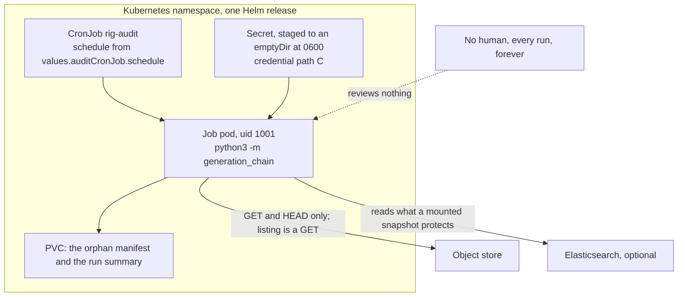

**What runs.** `python3 -m generation_chain` and nothing else, from
`templates/audit-cronjob.yaml`, on whatever schedule
`auditCronJob.schedule` names. The delete tool is not installed into that
process: `reclaim/` is never imported on the audit path, so no `--execute`
exists to be reached. This is the same executable as mode 2 and the same
structural guarantee.

**Credential.** Path C, the same Kubernetes Secret staged by a root init
container into an emptyDir so a non-root container can read it at 0600. It
differs from mode 3 only in what the process does with it.

**Who reviews.** Nobody, ever, by design. That is acceptable here for one
reason and it is worth stating rather than assuming: the scheduled process
cannot delete. Review exists to stand between a wrong answer and an
irreversible act, and there is no irreversible act on this path. A wrong
manifest here is a wrong report.

**What an attacker gains.** Recurring access to a store credential and,
optionally, an Elasticsearch read credential, held by a pod that comes back on
a schedule. Killing the pod does not end it. They also gain the manifest on the
PVC, which is a map of the repository: object keys, and by inference the
indices and snapshots behind them. That is disclosure, not destruction.

**What is different from the other three.** It is the only mode that runs
forever without anyone deciding to run it. Modes 1 and 3 are started by a
person, mode 2 by a pipeline trigger or a schedule a person configured on a
pipeline that cannot delete. This one is a standing, unattended process holding
a live credential, and its risk is duration rather than privilege: the same
credential, exposed continuously instead of for one job.

The temptation this mode creates is the dangerous part. A scheduled audit
produces a manifest nobody reads, and the obvious next step is to have
something act on it. That step removes the property that makes scheduling safe
at all, and it is tracked separately as
[issue 13](https://github.com/thanatostyrannos/elasticsearch-oci-s3-workaround/issues/13)
rather than treated as a configuration change.

### Comparison across the four modes

| | Mode 1: standalone, at a prompt | Mode 2: audit in a GitLab worker | Mode 3: churn rig in Kubernetes | Mode 4: audit on a timer in Kubernetes |
|---|---|---|---|---|
| Credential held | Path A: a file on local disk, store plus optional Elasticsearch | Path B: a File-type CI/CD variable staged to runner-local disk | Path C: a Kubernetes Secret staged into an emptyDir, plus a separate harness Elasticsearch credential | Path C, the same Secret as mode 3 |
| Delete reachable | Yes, by running the delete tool deliberately | No; `reclaim/` is never imported, no `--execute` flag exists in this pipeline | Yes, when `qualify.dryRunOnly` is explicitly set to `false` (a config default, not a structural absence) | No; `reclaim/` is never imported, and no delete flag exists on this path |
| Human review | A human reads the manifest, computes the digest, types the approval | None needed; nothing here can delete | None; the digest is scraped from the tool's own dry-run output and reused automatically | None, ever, and none needed: nothing here can delete |
| Blast radius if compromised | Whatever the operator's host and its cached credentials reach; an attacker can compute a matching approval digest itself | The store credential and optional Elasticsearch read credential, for one job's duration, on a shared runner | The store credential, the harness's Elasticsearch credential, and exec access to a root-run container, all in one namespace | The same credentials as mode 3, but held by a process that returns on a schedule rather than once |
| Worst case | Attacker with host control acts as the operator: reads the manifest, computes the digest, executes | Attacker steals the credential value and uses it outside this tool, limited by the IAM policy attached to the key | Attacker inherits a namespace already holding two live credentials and, if dry-run is off, an unattended delete loop | Continuous credential exposure, plus the manifest as a map of the repository. Disclosure, not destruction |


## 2. Trust boundaries

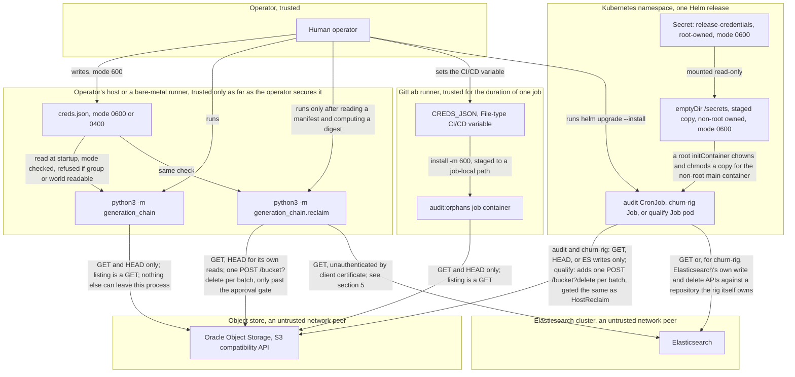

**What this shows.** Six zones. The operator is the only trusted human
actor. The host, the CI runner and the Kubernetes namespace are each trusted
only for as long as their own access controls hold; none of them is trusted
by construction. The object store and Elasticsearch are both external
network peers this tool has no control over. Every arrow that crosses a zone
boundary is annotated with what actually crosses it, not with what the tool
intends to send: `HostAudit` and `CIJob` are drawn identically because the
audit's method allowlist is the same file
(`generation_chain/sources/http_reads.py`) regardless of which zone runs it.

**What it does not cover.** It says nothing about which host, runner or
cluster is trustworthy in practice; that is an organisational question, and
[what-we-need-from-you.md](what-we-need-from-you.md) already asks it. It
also treats "Elasticsearch" as one zone, which understates it: the veto
connection in `corroboration.py` authenticates the operator to the cluster
with a bearer credential, but nothing authenticates the cluster to the
operator beyond ordinary TLS server verification, and for the in-cluster
deployment shape the connection is not even TLS. Section 5 covers that gap.

## 3. Credential lifecycle

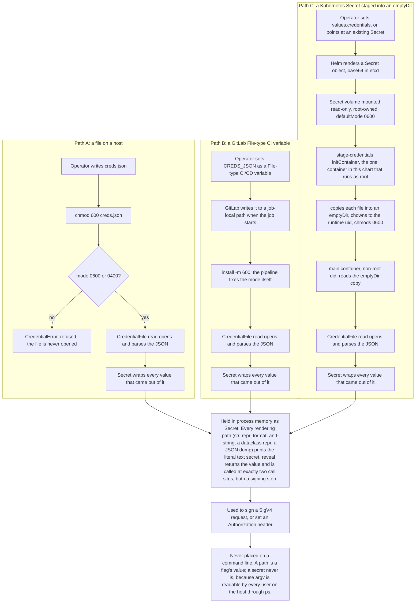

**What this shows.** All three delivery paths converge on the same in-memory
representation (`Secret`, in `generation_chain/credentials.py`) before the
value is ever used, and all three are checked by the same file-mode gate
(`require_private`). The mode check is the one control common to every path:
a credential that arrives group- or world-readable is refused before it is
opened, regardless of whether it arrived by `chmod`, by a CI pipeline
fixing the mode for the operator, or by a Kubernetes-staged copy.

Two things are deliberately absent and drawn that way. There is no
`--secret-key VALUE` flag anywhere in this tool; only a path can be named on
a command line, and `ps` on a shared host can read anyone's argv. And there
is no fourth path that skips the mode check: the environment-variable
fallback (`AWS_SECRET_ACCESS_KEY`, `GENCHAIN_ES_PASSWORD`, and so on,
documented in `generation_chain/credentials.py`) is not drawn above because
it never becomes a file, but it is still wrapped in `Secret` the moment it
is read, and it is explicitly the path the module's own docstring calls
"supported because CI needs it, not recommended": `/proc/<pid>/environ` is
readable by the same host user, and a container's environment shows up in
an `inspect`.

**Where a secret could be observed by another user, named explicitly:**

- **Path A, between write and `chmod`.** A file created at the default
  umask before the operator fixes its mode is briefly readable by whoever
  else is on the host. `require_private` catches this on every subsequent
  read, but it cannot retroactively un-observe a window that already
  passed.
- **Path A/B, the environment fallback.** Any process on the same host
  running as the same user can read another process's environment through
  `/proc/<pid>/environ`. This is why the module's own hierarchy puts the
  environment last, behind an explicit file.
- **Path B, GitLab's own log masking.** GitLab masks a File-type variable's
  *content* from job logs, but the file it writes exists in plaintext on
  runner-local disk for the job's duration, at a mode the pipeline fixes
  with its own `install -m 600` step (visible in
  `gitlab/readonly-scan/.gitlab-ci.yml`). Anyone else with shell access to
  that runner while the job runs can read it, same as any other process
  reading another user's file at 0644 would fail to.
- **Path C, the Secret at rest.** A Kubernetes `Secret` is base64, not
  encryption. Whether it is encrypted at rest depends on whether the
  cluster's etcd has encryption-at-rest configured, which is a cluster
  property this chart does not control and this document cannot verify.
- **Path C, the root-privileged staging step.** `stage-credentials` is the
  one container in every pod this chart creates that runs as `runAsUser: 0`.
  It exists solely because a Secret volume is root-owned at 0600 and the
  main container runs non-root (uid 1001 in the published image), so
  nothing else can open it. That is a deliberate, narrow privilege
  escalation inside the pod, not a bug: the container does nothing but copy,
  `chown` and `chmod`, and it runs before the main container starts, never
  alongside it.

## 4. Attack surface: data flow diagram with STRIDE

STRIDE below stands for Spoofing, Tampering, Repudiation, Information
disclosure, Denial of service and Elevation of privilege, the standard
threat categories a data flow diagram is usually annotated against. Each
edge below names the ones that actually apply to that input; a category left
off an edge was considered and judged not to apply, not skipped.

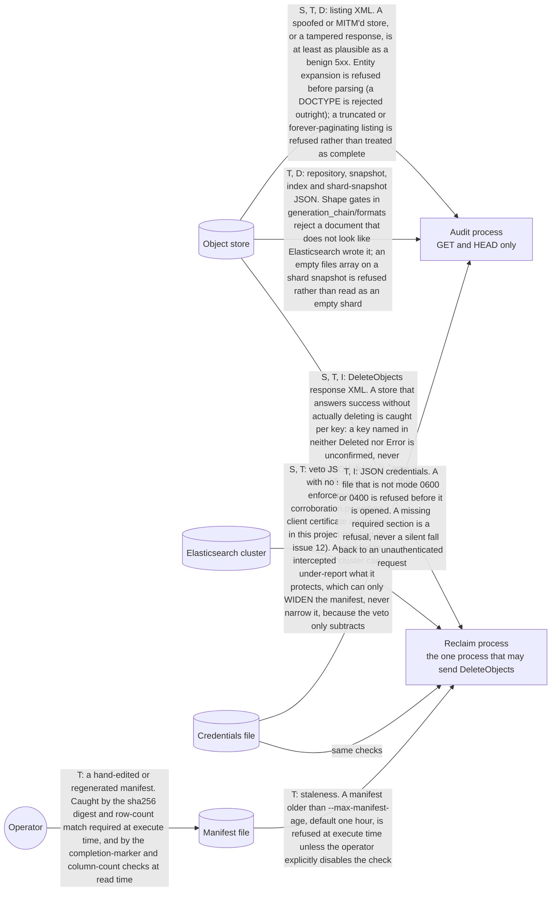

**What this shows.** Every place bytes this tool did not generate itself
cross into it, and what could be hostile about each one. Three findings
already closed
(the transport TLS gap, the XML entity-expansion gap, and the unmarked MD5
call, all in [evaluation-report.md](evaluation-report.md)'s CAT I/II list)
map onto specific edges above. One is not closed and is not in that report:
the Elasticsearch veto's transport has no scheme check at all.
`generation_chain/sources/s3.py` refuses plain HTTP off loopback for both
the audit and the delete path (`_refuse_plain_http`, called from both
`sources/s3.py` and `reclaim/cli.py`). `generation_chain/corroboration.py`
has no equivalent function; `ElasticsearchVeto._get` builds a
`urllib.request.Request` from whatever `--elasticsearch` names and sends it
with no scheme check at either the audit path or the reclaim path. The
Helm chart's own default endpoint for an in-cluster Elasticsearch
(`rig.esUrl` in `_helpers.tpl`, when `elasticsearch.external` is false) is
`http://`, not `https://`. This is the one honest disagreement between what
this document found and what the two existing security documents cover:
they audited and fixed the object-store transport; the cluster transport
that feeds the one control capable of shrinking a manifest was not in
scope for that fix and remains open.

**What it does not cover.** It does not model the operator's own terminal
or the CI runner's job scheduler as adversarial; both are inside the trust
boundary in section 2. It does not re-derive the entity-expansion
measurement (already done, with numbers, in
[evaluation-report.md](evaluation-report.md)). It does not cover JSON
parsing depth: `corroboration.py` and the repository-document readers use
`json.loads` with no depth limit, and a sufficiently nested document could
exhaust the interpreter's recursion limit. That was not measured for this
document the way the XML entity expansion was, so it is recorded here as
unreviewed rather than asserted either way.

## 5. What the Elasticsearch veto protects, and what it does not

An operator reading only the class name (`Veto`) or the corroboration
step's plain-English description tends to overestimate its reach. This
diagram exists because getting this wrong in either direction changes what
a security reviewer should require before trusting a manifest: too broad, an
operator skips a check they still need; too narrow, an operator distrusts a
control that is actually doing its job.

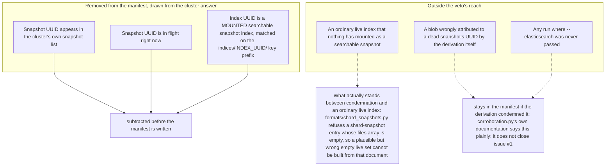

**What this shows.** The veto (`generation_chain/corroboration.py`) matches
on two axes only: an exact snapshot UUID, and an index UUID reachable
through `indices/INDEX_UUID/` for an index that is a mounted searchable
snapshot. An ordinary live index that nothing has mounted, which is the
common case, is not in its scope at all. What protects an empty shard
directory in that case is not the veto; it is the parser's own refusal
(`generation_chain/formats/shard_snapshots.py`) to treat a shard-snapshot
document whose `files` array is empty as evidence that the shard is
legitimately empty, because Elasticsearch always writes at least a Lucene
commit file for a shard it actually snapshotted. That refusal is a shape
gate, not a cluster consultation, and it holds with or without
`--elasticsearch`.

**What it does not cover.** Attribution errors. If the derivation
misattributes a live snapshot's blob to a dead snapshot's UUID, the veto
protects nothing, because the row now carries the wrong snapshot's identity
and the cluster is not protecting that identity. `corroboration.py`'s own
docstring is direct about this: "It does not close issue #1." The guards
against that class of error live in `generation_chain/derivation/shards.py`,
not here, and are out of scope for this document; see
[../engineering/algorithms.md](../engineering/algorithms.md).

## 6. Blast radius: from a wrong row to unrecoverable loss

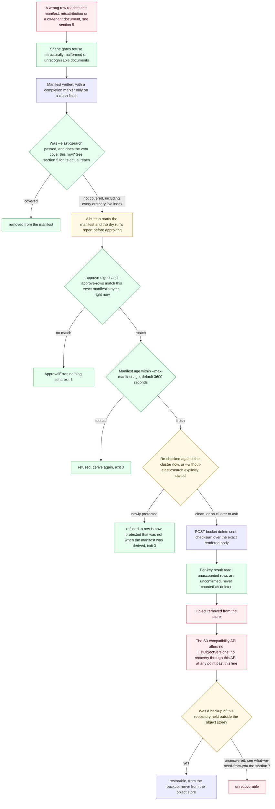

**What this shows.** The chain from a wrong row to actual loss, with every
gate marked as enforcement (green: a technical control that stops the run
by itself) or advisory (amber: relies on a human decision or an
organisational fact this codebase cannot verify). Read bottom to top for
what a security reviewer should ask for: everything below "Was a backup
held outside the object store" is a yes/no this repository's own
[what-we-need-from-you.md](what-we-need-from-you.md) already flags as
unanswered, and it is the single most consequential unanswered question on
that list, because it is the only thing that turns "unrecoverable through
this API" into "unrecoverable, full stop."

Two nodes are marked advisory on purpose, and both deserve the label
exactly, not a stronger one. "A human reads the manifest" has no technical
backstop: nothing in this codebase verifies that the human actually read
it, only that the digest they supply matches the file. The approval gate
(`generation_chain/reclaim/approval.py`) is real and it is enforcement, but
what it enforces is narrower than "this manifest is correct": it enforces
"you are approving the exact bytes in front of you, not a stale or edited
copy." A confidently wrong manifest, read carelessly, produces a matching
digest just as easily as a correct one. Section 8 covers where that
distinction matters for the automated test-rig path.

**What it does not cover.** It does not cover the object store's own IAM
policy. See section 7: this tool's read-only guarantee for the audit
process is a property of the audit process's code, not of the credential's
permissions at the store.

## 7. Privilege and permitted-operation map

```mermaid
flowchart TD
    subgraph AuditBox["Audit: python3 -m generation_chain"]
        A_Holds["Holds: the store credential (S3 or OCI), optionally an Elasticsearch read credential"]
        A_Can["Can: GET and HEAD, nothing else. Listing a bucket is a GET with list-type=2. ALLOWED_METHODS in http_reads.py names exactly these two verbs"]
        A_Cannot["Structurally cannot: send DELETE or POST at all. ForbiddenMethod is raised if a caller ever tries, and reclaim/ is never imported here, so the code path to build one does not exist in this process"]
    end

    subgraph ReclaimBox["Reclaim: python3 -m generation_chain.reclaim"]
        R_Holds["Holds: the same class of store credential as audit, plus optionally an Elasticsearch read credential for the execute-time re-check"]
        R_Can["Can, only past --execute plus a matching approval: one POST bucket delete per batch"]
        R_Cannot["Without --execute: nothing leaves this process for the delete request. Dry run builds the exact bytes and stops before opening a socket for them"]
    end

    subgraph ChurnBox["Load generator: snapshot_churn_rig.py, test rig only"]
        C_Holds["Holds: the harness's own Elasticsearch credential, kept separate from the audit's Elasticsearch credential; optionally an S3 listing credential"]
        C_Can["Can: write documents, take snapshots, delete snapshots and indices, all through Elasticsearch's own API"]
        C_Cannot["Cannot touch the object store's delete API directly. It manufactures the leak the rest of this project reclaims; it has no reclaim capability of its own"]
    end

    A_Holds --> A_Can --> A_Cannot
    R_Holds --> R_Can --> R_Cannot
    C_Holds --> C_Can --> C_Cannot
```

**What this shows.** For each process, what it holds, what it can do with
it, and what is structurally impossible rather than merely undocumented.
The audit's read-only property in particular is drawn as impossible rather
than disallowed, because that is what the code shows: `ALLOWED_METHODS` is
checked before every request leaves `HttpReader.get`, the check was once an
`assert` (stripped by `python3 -O`, and a DELETE reached the transport
under it during testing), and it is now a raised `ForbiddenMethod`.

**What it does not cover, and this is the sharpest edge in this whole
document.** The read-only property above is a property of the audit
process's own code. It is not a property of the credential the audit
process holds. Nothing in this project scopes the store credential's IAM
policy down to read-only actions. The same access key an operator points at
the audit tool, if it is also handed to the reclaim tool, or copied out of
`creds.json` and used directly against the S3 API with any other client,
can delete whatever the underlying policy allows it to delete. This
tool's guarantee is "this process will not send that request," not "this
credential cannot make that request." A security reviewer sizing the blast
radius of a leaked `creds.json` should size it against the IAM policy
attached to the key inside it, not against which binary the file was meant
for. Neither this document, the README, nor the evaluation report
recommends a separate, delete-scoped-down IAM identity for the audit path
versus the reclaim path; that is a gap worth closing at the deployment
layer, because this codebase cannot close it from inside the process.

## 8. The approval chain

```mermaid
sequenceDiagram
    participant Op as Operator
    participant Audit2 as Audit process
    participant Store2 as Object store
    participant ES2 as Elasticsearch
    participant Reclaim2 as Reclaim process
    participant Appr as approval.py
    participant Rechk as recheck.py

    Op->>Audit2: python3 -m generation_chain, writes orphans.tsv
    Audit2->>Store2: GET/HEAD listings and repository documents
    Store2-->>Audit2: bytes, or a refusal
    opt corroboration requested with --elasticsearch
        Audit2->>ES2: GET the veto
        ES2-->>Audit2: veto JSON, or the run refuses rather than treat a failed call as an empty veto
    end
    Audit2-->>Op: orphans.tsv, completion marker appended only on a clean finish

    Op->>Reclaim2: reclaim, no --execute
    Reclaim2-->>Op: DRY RUN report, the first batch's exact request, its sha256 digest, its row count

    Note over Op: the human step. The operator reads the manifest and the dry run report.

    Op->>Op: independently computes sha256 and a row count from the file on disk
    Op->>Reclaim2: --execute --approve-digest DIGEST --approve-rows N, plus --elasticsearch or --without-elasticsearch

    Reclaim2->>Appr: verify_approval(manifest, digest, rows)
    opt digest or row count does not match this exact file
        Appr-->>Reclaim2: ApprovalError
        Reclaim2-->>Op: exit 3, nothing sent
    end

    Reclaim2->>Rechk: staleness_problem(age, max_manifest_age)
    opt manifest older than --max-manifest-age
        Rechk-->>Reclaim2: refused
        Reclaim2-->>Op: exit 3, derive again
    end

    opt --elasticsearch was given
        Reclaim2->>ES2: re-fetch the veto, right now
        opt any manifest row is newly protected
            ES2-->>Reclaim2: N rows now covered
            Reclaim2-->>Op: exit 3, nothing sent
        end
    end

    Reclaim2->>Store2: POST bucket delete, one batch, checksum over the exact rendered body
    Store2-->>Reclaim2: DeleteResult, per key
    Reclaim2-->>Op: deleted, already_absent, failed, unconfirmed; exit 0 or 4
```

**What this shows.** Every refusal point between a derived manifest and an
actual delete, and what would have to be defeated to reach execution
anyway: a matching sha256 over the exact bytes, a matching row count, a
manifest fresher than the age limit, and, if a cluster was named, a veto
re-checked at the moment of execution rather than trusted from when the
manifest was derived. Defeating the digest check requires either the real
manifest file or a second file that collides with it under sha256; defeating
the freshness check requires the operator to pass `--max-manifest-age 0`,
which is a deliberate override recorded in the command line itself, not a
default.

**What it does not cover, and where this diagram's "human step" does not
hold.** `reclaim_test_protocol.py`, the harness the qualification pipeline
runs (`gitlab/kubernetes-test-rig/chart/templates/qualify-job.yaml`), scrapes
`--approve-digest` and `--approve-rows` straight out of the dry run's own
printed text with a regular expression and feeds them back into the next
`--execute` call automatically. This is not a bypass of the digest check:
the check still runs, and it still refuses if the manifest changed between
the dry run and the execute, which is exactly the anti-drift property the
harness's own documentation says it is proving. But it means the one path
in this entire system where approval is automated rather than typed by a
human is the qualification loop, and what that loop exercises is the
mechanism (does the binding between approval and exact bytes hold), never
the judgment (is this manifest correct). A security reviewer should not
read a passing qualification run as evidence that the human-review half of
this control has ever been exercised, because it has not; it exercises the
other half.

## 9. Manifest lifecycle

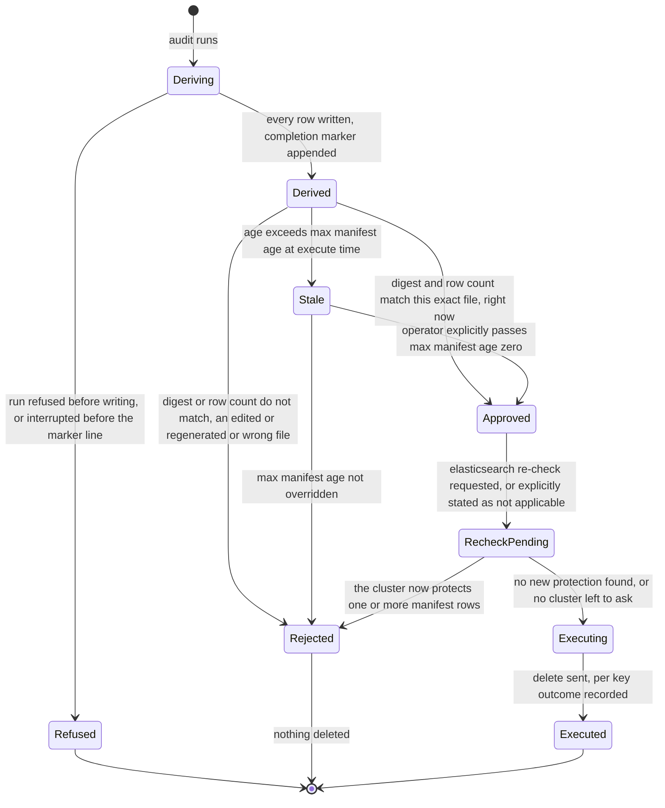

**What this shows.** A manifest is not a static artifact; it is a
short-lived thing that either advances through every gate or dies at one of
them, and the state it can be in is exactly what the code checks for, no
more. There is no state where an edited manifest reaches `Approved`: the
digest is computed over the exact bytes on disk at approval time, so an
edit produces a new digest and the file simply becomes a different,
un-approved manifest. There is no state where staleness is silently
ignored; `Stale` only reaches `Approved` through an operator action that
appears verbatim on the command line used to run it.

**What it does not cover.** What happens to the manifest file itself after
`Executed`: whether it is retained, where, and for how long, is a retention
question this document treats as out of scope, matching the same block of
questions in [what-we-need-from-you.md](what-we-need-from-you.md).

## 10. Deployed-mode surface: GitLab pipelines and the Helm chart

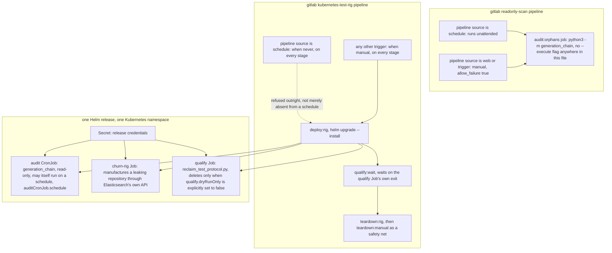

**What this shows.** The safety property `gitlab/README.md` states in
prose (the thing capable of deleting is never the thing on the easy path,
or the schedule) drawn as two separate mechanisms. The read-only pipeline
runs unattended by design, because nothing it can do needs a human present.
The rig pipeline refuses to run from a schedule at all, on every stage,
which is a stronger statement than "not currently scheduled": an operator
would have to edit `gitlab/kubernetes-test-rig/.gitlab-ci.yml` itself to
change it, and that edit is visible in the same code review that would
catch anything else here.

**What it does not cover, and a residual risk worth naming.** The chart's
templates that can delete
(`gitlab/kubernetes-test-rig/chart/templates/qualify-job.yaml`) and the ones
that build the leak
(`gitlab/kubernetes-test-rig/chart/templates/churn-rig-job.yaml`) both carry
an `argocd.argoproj.io/sync-wave` annotation, alongside the audit CronJob and
the MinIO bucket setup job. That annotation exists to order objects within
one ArgoCD sync, which only matters if this chart is deployed through
ArgoCD rather than through the GitLab pipeline pictured above. The "never
triggers from a schedule" property is enforced entirely by
`gitlab/kubernetes-test-rig/.gitlab-ci.yml`'s own `rules:` blocks. It is a
CI-pipeline-level control, not a property of the Helm chart or of
Kubernetes itself, and it does not travel with the chart to a different
deployment path. An operator who adopts this chart under an
auto-syncing ArgoCD application, which is a common and often default
GitOps posture, is not automatically protected by the schedule refusal
this document draws above; whether a given sync would recreate a completed
Job depends on ArgoCD's own sync options and on whether anything in the
values actually changed, and that was not tested here. The honest statement
is narrower than "safe": the schedule refusal is real, and it is scoped to
one deployment path.

## Residual risk, stated plainly

A threat model that ends in "everything is fine" has not done its job. This
one does not conclude that. In order of how much they matter:

1. **No documented recovery path.** The object store offers no
   `ListObjectVersions`. A wrong delete's only possible undo is a backup
   held elsewhere, and whether one exists, where, and how current it is,
   is unanswered in
   [what-we-need-from-you.md](what-we-need-from-you.md) section 7. Every
   other control in this document exists to prevent reaching this state;
   none of them helps once it is reached.
2. **The Elasticsearch corroboration transport enforces no scheme and
   presents no client certificate.** `generation_chain/corroboration.py`
   has no equivalent to `sources/s3.py`'s `_refuse_plain_http`, and the
   Helm chart's default in-cluster endpoint is `http://`. This is the one
   path whose entire job is shrinking a manifest by asking a cluster what
   to protect, and it is not held to the same transport-security bar the
   evaluation report already applied to the object-store path. Closing it
   is the same fix already applied elsewhere: refuse a non-loopback,
   non-TLS endpoint by default, with an explicit override for lab use.
   Client-certificate authentication for the cluster connection does not
   exist anywhere in this project, tracked as issue 12, and is not
   available as a mitigation today.
3. **Read-only is a property of the code, not of the credential.** The
   audit process cannot send a delete; the IAM identity it authenticates
   with is not thereby prevented from deleting anything, if that identity's
   policy allows it and someone uses it with a different client. Scoping
   the audit credential to read-only actions at the object store is a
   deployment-layer control this project does not provide and does not
   currently recommend anywhere in its documentation.
4. **The veto's scope is narrower than its name suggests.** It protects a
   mounted searchable snapshot's snapshot and index UUIDs. It does not
   protect an ordinary live index, and it does not close attribution
   errors; `corroboration.py` says the second part plainly in its own
   documentation.
5. **The schedule-refusal property for the delete-capable pipeline is
   pipeline-scoped, not chart-scoped.** A GitOps deployment of the same
   Helm chart through a route other than the provided GitLab pipeline does
   not inherit that refusal automatically.
6. **The automated qualification loop exercises the approval mechanism,
   not human judgment.** A passing qualification run is evidence the
   digest-and-row binding works; it is not evidence anyone has read a
   manifest for correctness before approving it, because nothing in that
   loop does.
7. **Everything the ASD STIG assessment already marks Not Reviewed stays
   Not Reviewed here too.** Log destination and retention, host FIPS
   status, penetration-testing cadence, and the rest of
   [what-we-need-from-you.md](what-we-need-from-you.md) are organisational
   facts no static read of this repository can establish. This document
   does not attempt to guess them into a better-looking status.

**Attributed by mode.** The risks above are properties of the codebase and
apply wherever it runs; here is which ones land hardest on which of the
four modes in section 1.

- **Mode 1, standalone at a prompt.** Risks 1 and 3 matter most here. The
  operator's host holds a live credential (risk 3: read-only is a property
  of the code, not the credential), and it is the one place an attacker who
  gets code execution can also compute a matching approval digest and run
  `--execute` themselves, so the no-recovery-path risk (1) is one host
  compromise away rather than several infrastructure layers away. Risk 4
  lands hardest on this mode's own review step: a human who overestimates
  the veto's reach approves rows the veto never protected in the first
  place.
- **Mode 2, the audit in a GitLab worker.** Risk 3 is the risk that reaches
  this mode: there is no delete path here, so the only way this mode
  contributes to eventual loss is a stolen credential used outside this
  tool entirely, against whatever the IAM policy attached to the key
  allows. A manifest this mode produces can still carry the veto's
  narrower-than-it-sounds scope (risk 4) if someone later runs the delete
  tool against it in mode 1; that risk belongs to the manifest, not to
  whichever mode produced it.
- **Mode 3, the churn rig in Kubernetes.** Risks 2, 5 and 6 belong here
  specifically. The Elasticsearch transport gap (risk 2) is exercised by
  this mode's own in-cluster default endpoint, `http://`, not a
  hypothetical one; risk 5's GitOps bypass of the schedule refusal is a
  statement about this pipeline; and risk 6, the automated qualification
  loop exercising the approval mechanism but never human judgment,
  describes this mode exactly and no other one. This is also the mode
  where risk 1 is least abstract: it is the only mode where a delete can
  run unattended as intended behaviour, not as the result of a compromise.

None of the above changes the conclusion that the destructive path is
gated by a real, source-verified control (the digest-and-row approval in
`generation_chain/reclaim/approval.py`, with dry run as the unconditional
default). It changes what a reviewer should ask for before treating that
gate as sufficient on its own: a closed transport gap on the Elasticsearch
side, a scoped-down IAM policy for whichever credential the audit path
actually uses, and an answer to the backup question, in that rough order of
how much each one matters if every other control fails at once.

## Verification

Mermaid syntax in every diagram above was hand-checked against GitHub's
rendering rules (quoted labels wherever a paren, colon, slash, quote or
comma appears; no reserved node ids; no literal angle brackets) rather than
machine-rendered, for the reason given in "How to read the diagrams" above.

`python3 -m unittest discover -s tests -q` was run against this addition.
Results, and what they mean, are recorded in the report accompanying this
document rather than repeated here, because a link-checker result is a
fact about this document's plumbing, not about the system it describes.
